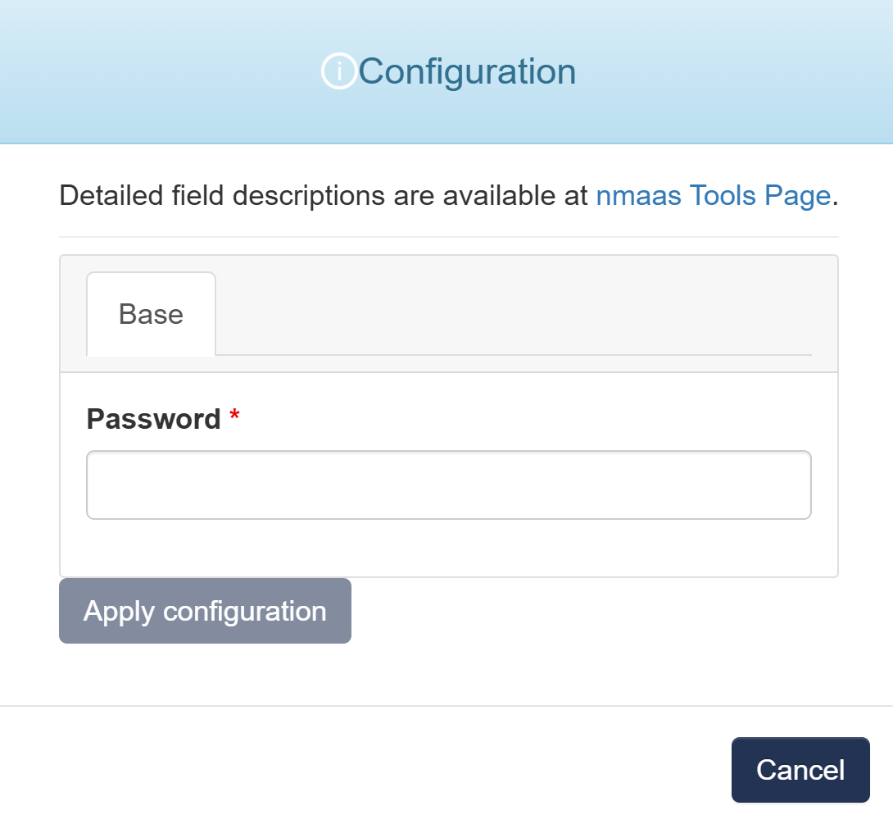

# Valkey

{ align=right width="100" }

Valkey is a high-performance data structure server that primarily serves key/value workloads. It supports a wide range of native structures and an extensible plugin system for adding new data structures and access patterns.

## Configuration Wizard

Configuration parameters to be provided by the user are explained in the subsections below.

{ width="400"}

### Base tab

- `Password` - A password for accessing the application