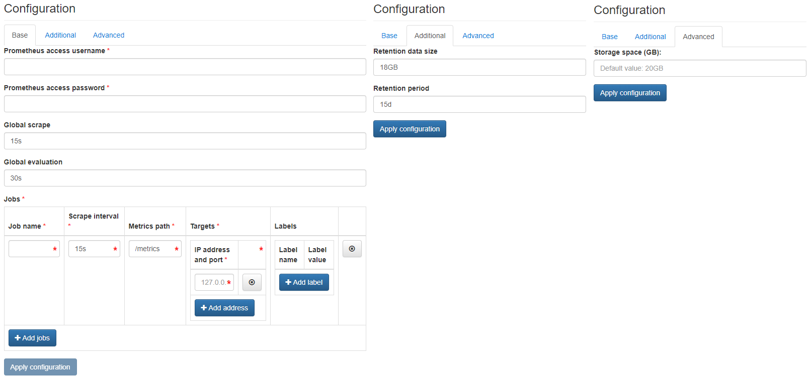

# Victoria Metrics

{ align=right width="150" }

VictoriaMetrics is a highly scalable high-performance database that can be used as an external long-term storage for Prometheus metrics.

It can also completely replace Prometheus and perform the polling by itself, using a configuration format that is compatible with existing Prometheus deployments.

Apart from Prometheus, it can also substitute InfluxDB, OpenTSDB, and Graphite, as a result of providing compatible interfaces for these protocols. <

Stored metrics can be easily visualized by Grafana, by adding the VictoriaMetrics instance as a Prometheus datastore.

No matter what protocol is used to store data in VictoriaMetrics, it is queried using the same web endpoint, and only a single datasource is required in Prometheus.

Another feature of VictoriaMetrics is to use advanced PromQL expressions, not available in the Prometheus implementation.

More details about this can be obtained from the [official documentation page](https://github.com/VictoriaMetrics/VictoriaMetrics/wiki/MetricsQL).

## Configuration Wizard

Configuration parameters to be provided by the user are explained in the subsections below.

### Base tab

- `Global scrape` ***[Optional]*** - How frequently to scrape targets by default
- `Global evaluation` ***[Optional]*** - How frequently to evaluate rules
- `Job name` - The job name assigned to scraped metrics by default
- `Scrape internal` - How frequently to scrape targets from this job
- `Metrics path` - The HTTP resource path on which to fetch metrics from targets
- `Targets / IP address and port` - The targets specified by the static config (multiple allowed)
- `Labels / Label name & Label value` ***[Optional]*** - Labels assigned to all metrics scraped from the targets (multiple allowed)

Multiple jobs can be configured by using the Add job button.

Target is a valid string consisting of a hostname or IP followed by an optional port number.

For detailed description of the above parameters please refer to Victoria Metrics online documentation.

### Additional tab

- `Retention period (in months)` ***[Optional]*** - The time period for which the monitoring data should be retained (default value is displayed in the placeholder).
- `Allocated storage space (GB)` ***[Optional]*** - Amount of storage to be allocated to persist data generated by this Victoria Metrics instance (default value is displayed in the placeholder), e.g. `10`, `20` or `30`.

