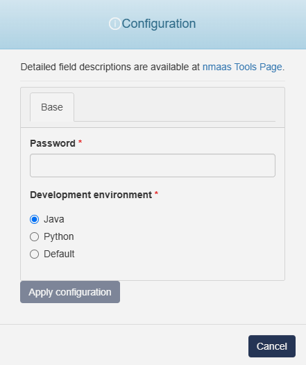

# VS Code server

{ align=right width="100" }

Code on any device with a consistent development environment, using cloud servers to speed up tests, compilations, downloads, while preserving battery life.

## Configuration Wizard

Configuration parameters to be provided by the user are explained in the subsections below.

{width="400"}

### Base tab

- `Password` - Password to secure access to the VS Code Server when connecting remotely
- `Developer envirometn` - Configure the programming languages and tools available in the server environment:
    - `Java` - Install and set up tools like the JDK and extensions for Java development
    - `Python` - Install Python and relevant extensions or tools (e.g., pip, virtualenv) for Python development
    - `Default` - Default environment configuration to provide general-purpose development tools and settings

