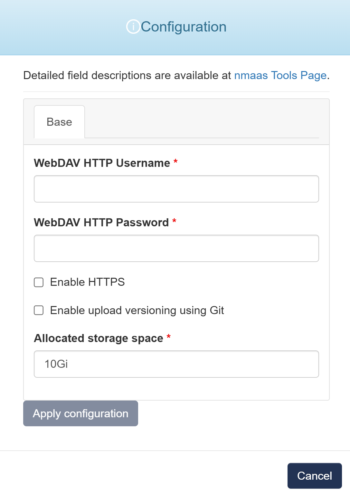

# WebDAV

This application represents a simple WebDAV server which can accept remote files.

During the deployment process, the user can also choose whether the uploaded files should be versioned using Git.

Three deployments options are possible:

- Do not use Git for file versioning;
- Initiate a local Git repository for file versioning which can be browsed using an embedded Git web interface;
- Integrate with a remote Git repository (e.g. GitHub) and automatically push any uploaded file to the remote git repository.

In case the third option is chosen, users are required to set up an SSH key pair which will have push access to the target repository.

The target repository URL also must be given in an SSH format during application deployment, e.g. `git@host.example.com/username/myrepo`.

## Configuration Wizard

Configuration parameters to be provided by the user are explained in the subsections below.

{ width="400"}

### Base tab

- `WebDAV HTTP Username` - Default username used to login to the instance
- `WebDAV HTTP Password` - Default user password used to login to the instance
- `Enable HTTPS` - Configure WebDAV to use HTTPS
- `Enable upload versioning using Git` - Feature that tracks uploaded file changes by integrating with Git for version control
- `Storage space (GB) [Optional]` - Amount of storage to be allocated to persist data generated by this Inventory instance (default value is displayed in the placeholder), e.g. 1, 2 or 3.