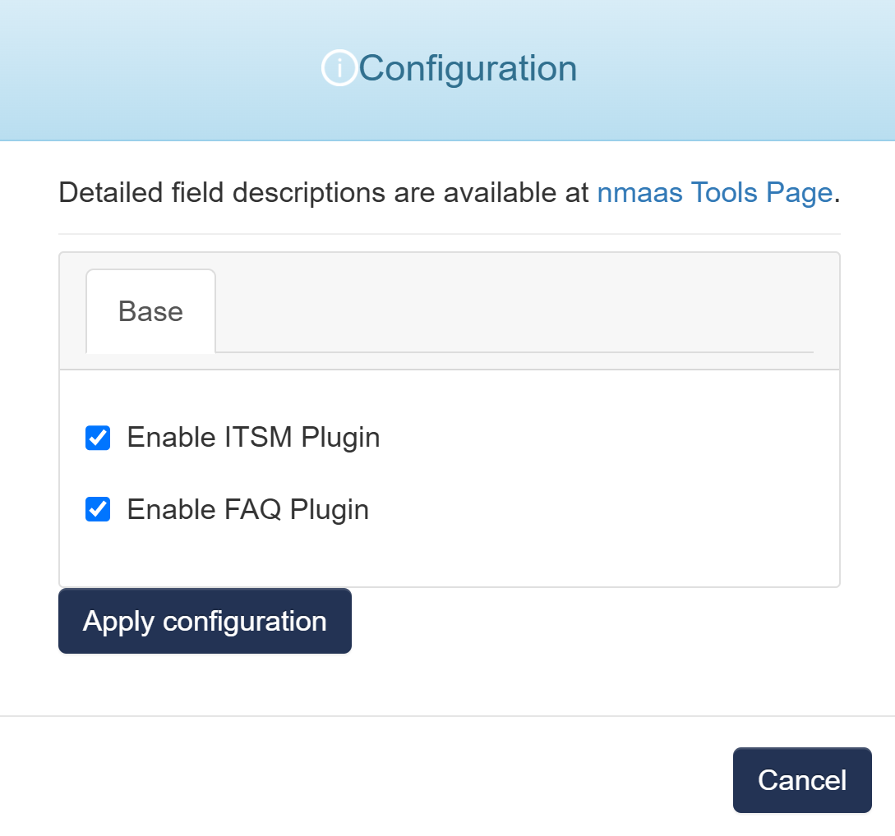

# Znuny

{ align=right width="100" }

Znuny/Znuny LTS is a fork of the ((OTRS)) Community Edition, one of the most flexible web-based ticketing systems used for Customer Service, Help Desk, IT Service Management.

## Configuration Wizard

Configuration parameters to be provided by the user are explained in the subsections below.

{ width="400"}

### Base tab

- `Enable ITSM Plugin` - Activate the IT Service Management (ITSM) plugin in Znuny to implement ITIL-based processes.
- `Enable FAQ Plugin` - Activate the FAQ plugin in Znuny to create and manage a knowledge base for frequently asked questions.