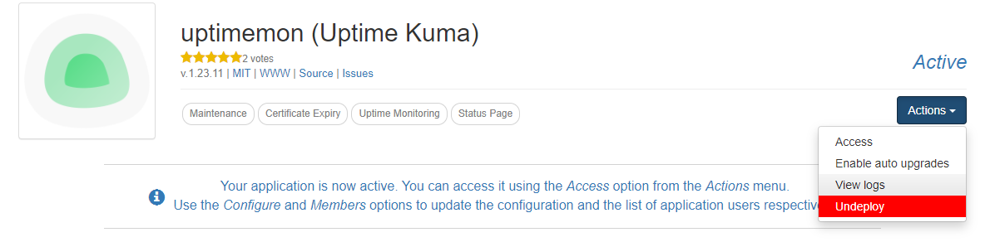
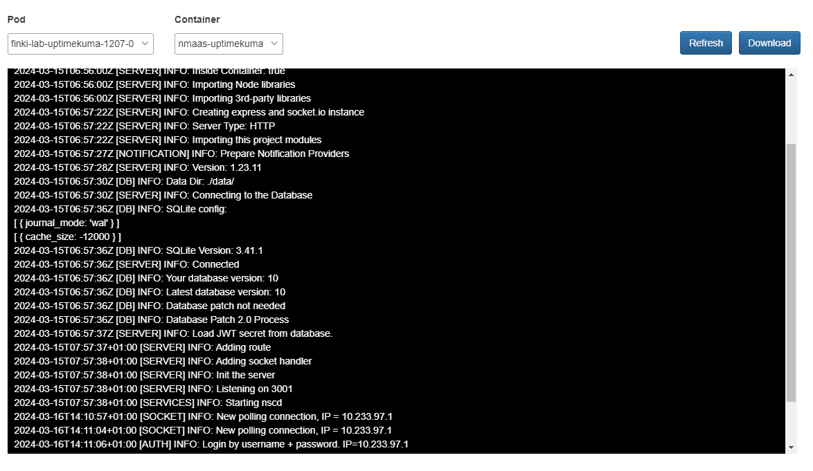
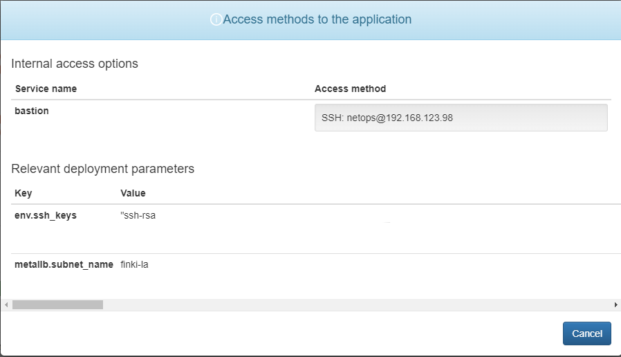
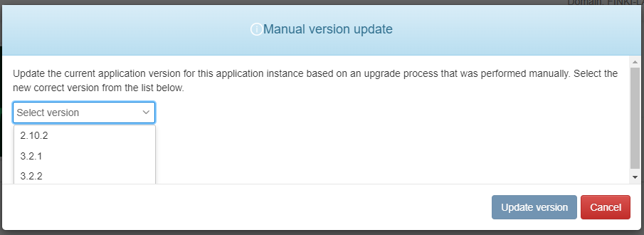

# 1.6.0

## General

[nmaas 1.6.0](https://github.com/nmaas-platform/nmaas-platform/releases/tag/v1.6.0) is packed with a number of improvements. The long awaited application log viewing has been implemented and is ready to be used for easier troubleshooting by end-users. Users can also now review the application parameters used during the initial deployment, while global administrators can mark an application instance as having been manually upgraded in the background.

In this version we also introduced a brand new use-case, nmaas for Virtual Labs, accompanied by a number of related new functionalities.

### Application Instance Log Viewing

Application instance logs can now be viewed directly from the nmaas Portal, enabling easier debugging.

Users can simply navigate to the application instance details page and select the `View Logs` option from the Actions dropdown. Log viewing can be enabled on a per-application basis. If a particular instance does not currently expose its logs, contact your nmaas Platform administrator for more information. 

Logs can either be viewed using the dedicated web viewer or downloaded for later analysis. In case a given application instance comprises multiple pods, logs are viewable for all of them.

Global administrators can enable log viewing for a given application by ticking the `Allow log access` checkbox when editing a particular version of the application. Note that the log viewing feature can be toggled on a per-version basis.

<figure markdown>
  
  <figcaption>Accessing the log viewer</figcaption>
</figure>

<figure markdown>
  
  <figcaption>The application instance log viewer</figcaption>
</figure>

### Deployment Parameters Viewing 

It is now possible to look at all the configuration parameters used for instantiating a given application instance once it has been deployed. In this release this is possible only for applications with multiple access methods defined, using the `Actions -> Access option`. In a subsequent patch release this feature will become globally available for all application instances.

<figure markdown>
  
  <figcaption>Viewing deployment parameters of an application instance</figcaption>
</figure>

### Manual Application Instance Update

Global administrators can now notify the nmaas Platform that an application instance has been manually upgraded in the background, bypassing the built-in update functionality of nmaas. This is useful if a more complex update operation needs to be done, for example between different incompatible major versions, and the administrator has to make manual changes from the CLI.

Once the global administrator has indicated that a manual update has been performed to a new version, the nmaas platform will continue tracking subsequent update paths from that point forward.

The manual update functionality is accessible via the `Actions -> Manual version update` menu of a particular application instance.

<figure markdown>
  
  <figcaption>Manually updating the version of an application instance</figcaption>
</figure>

## Virtual Lab

Version 1.6.0 also introduces a brand new nmaas use-case, nmaas for Virtual Labs. More information about this use-case is available in the dedicated page, [Introduction to nmaas Virtual Lab](../use-cases/virtual-lab/vlab-introduction.md).

### Domain Groups

It is now possible to specify what set of applications can be deployed by each domain. A domain group can contain one or more domains, precisely specifying what applications are available for deployment by the users in the given domains. Applications that haven't been whitelisted are simply not visible in the application list. A given domain can be part of multiple domain groups, and in that case the set of deployable applications is derived as a union operation of all whitelisted applications across all domain groups where the domain has been added. A detailed walkthrough is provided in the dedicated [Domain Groups](../use-cases/virtual-lab/domain-groups.md) page.

### Bulk Domain and User Deployments

It is now possible for global administrators and virtual lab managers (more details below) to register multiple users and assign them to domains using a single input file in CSV format uploaded to the Portal. More information is available in the dedicated [Bulk Domain Deployment](../use-cases/virtual-lab/bulk-domain-deployment.md) page.

### Bulk Application Instance Deployments

It is now possible for global administrators and virtual lab managers (more details below) to deploy multiple instances of a particular application in one go using a CSV file. Application deployment parameters can also be overridden per deployment. More information is available in the dedicated [Bulk Application Deployment](../use-cases/virtual-lab/bulk-application-deployment.md) page.

### New Virtual Lab Manager Role

A new system role has been added to the Platform component, `Virtual Lab Manager` that can be assigned to people responsible for organizing virtual labs on nmaas, without giving them a global administrator role. Virtual lab managers are allowed to:

- create new domain groups
- perform bulk domain deployments
- perform bulk application deployments

Application managers cannot directly edit domains or users, but it is possible to assign an existing user to an existing domain group using the bulk domain deployment functionality. 