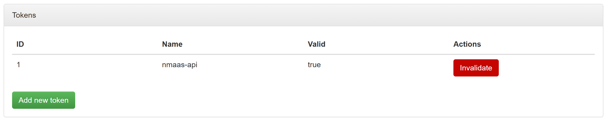

# 1.7.0

## General

[nmaas 1.7.0](https://gitlab.software.geant.org/nmaas/nmaas-platform/-/releases/v1.7.0) is a milestone release containing some long-awaited features including support for OIDC IdP login and introduction of user access tokens.

Apart from the major changes detailed below the following updates were made.

- Upgrade of Java to version 17 along with upgrading to Spring Boot 3.4.
- Added bulk deployment status and progress information on the bulk details view and summary information about all ongoing deployments.
- Implemented data caching mechanism to speed up application catalog view load time.

### Integration with OIDC-compliant IdP

Moved away from the custom SAML-based IdP integration in favor of adding OIDC support. Support for an OIDC-compliant Identity Provider can be enabled using a new set of parameters.

Such IdP is used for federated account login and the user account data and role assignment is still maintained in the nmaas database. 

### User access token management

Added possibility for users to generate personal access tokens to be used for interaction with the API bypassing the Portal and standard JWT-based mechanism.

The newly available authentication mechanism will be applied to existing or new REST endpoints as part of subsequent software releases, e.g. to enable new application version publishing.

<figure markdown>
  
  <figcaption>User token management view</figcaption>
</figure>