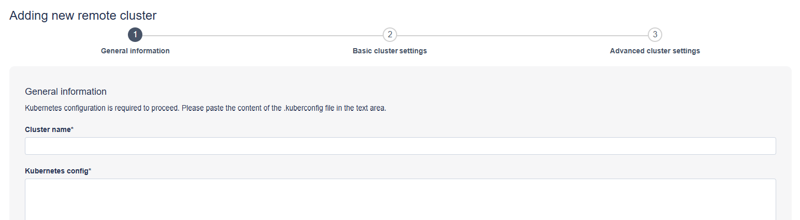
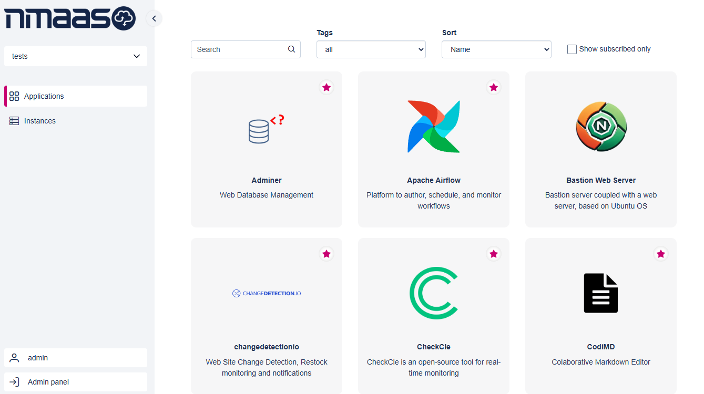
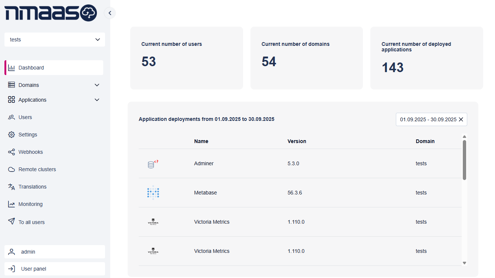
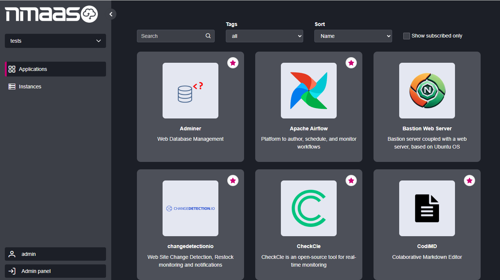
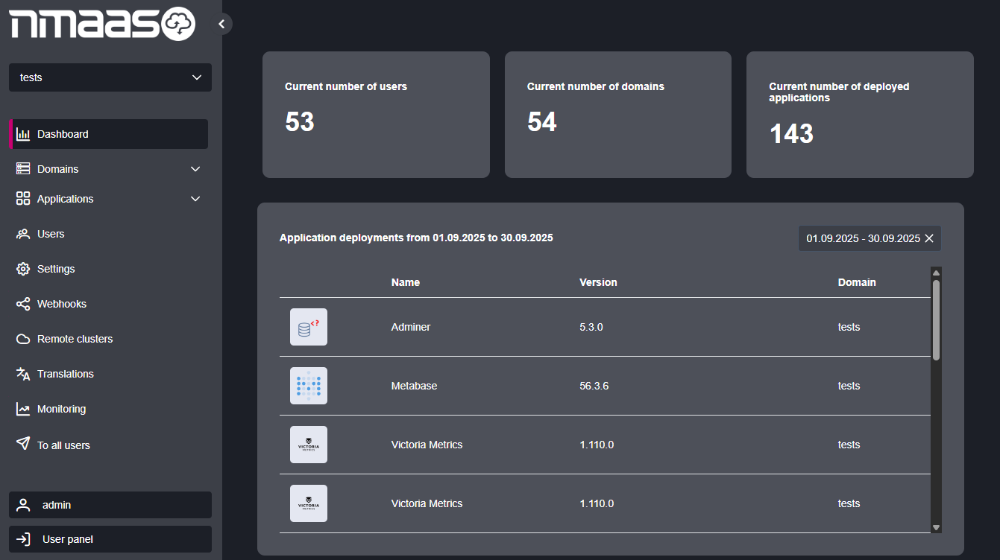

# 1.8.0

Date: 2025/09/05

## General

[nmaas 1.8.0](https://gitlab.software.geant.org/nmaas/nmaas-platform/-/releases/v1.8.0) is a milestone release including many features mainly focused on allowing support for remote cluster management and remote application deployment following a new nmaas use-case requirements.

## New Features

### Remote cluster management

Added possibility for domain administrators to onboard remote clusters based on kubeconfig files.

<figure markdown>
  
  <figcaption>New remote cluster form</figcaption>
</figure>

### Application deployment on remote clusters

Users are given an option during application deployment to select either the central cluster or any of the remote clusters assigned to their domain as target locations for their instance.

### Webhooks support

Administrators can now define remote endpoints that should be notified once one of the supported actions takes place in the Platform. This enables new integration options with external systems, based on the following events:

- Domain action
- Domain group action
- Application deployment
- User assignment

Optionally, webhook requests also support authentication tokens which can be passed as arbitrary HTTP headers, improving security.

### Application instance pausing support

Platform exposes new API endpoints for application instance scaling, allowing for pausing of idle applications and thus preserving cluster resources. Pausing/resuming of application instances is also possible from the web interface, via the `Actions` button on the instance view page.

## Enhancements

### Brand new Portal layout

Introduced new overall layout of the Portal based on a brand-new design, including dark mode and a dedicated Admin panel designed from scratch.

<figure markdown>
  
  <figcaption>New design of the front page</figcaption>
</figure>

<figure markdown>
  
  <figcaption>New admin panel</figcaption>
</figure>

<figure markdown>
  
  <figcaption>New design of the front page (dark mode)</figcaption>
</figure>

<figure markdown>
  
  <figcaption>New admin panel (dark mode)</figcaption>
</figure>

### Removed nmaas Janitor component

Operations performed by the Janitor component have been rewritten within the Platform to ease further maintenance and initial deployment of nmaas as a whole.

### Local Helm client

Simplified nmaas deployment architecture by incorporating Helm client in the Platform container, thus removing the necessity to run Helm commands over SSH. This should lead to more reliable and faster application deployment operations.

### More advanced readiness checks for applications

Application instance readiness check process now waits for all relevant Kubernetes Deployments and StatefulSets to become ready before updating the state of the entire instance.

### Upgrade of Java and major dependencies

Platform now runs on Java 21 and all other dependencies were bumped to recent versions.

## Bug Fixes

### Enabled missing email notification

Administrators are now notified with an email about any new application version that requires activation.
