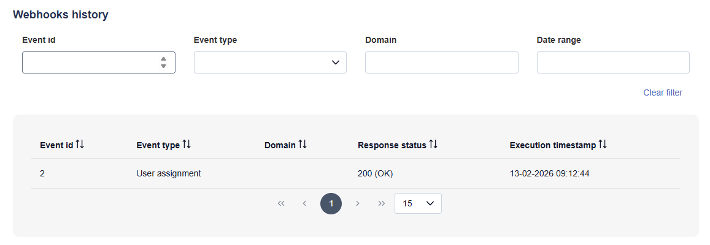

# 1.9.0

Date: 2026/01/28

## General

[nmaas 1.9.0](https://gitlab.software.geant.org/nmaas/nmaas-platform/-/releases/v1.9.0) is a milestone release including many features supporting or enhancing functionalities added in previous releases.

## New Features

### Webhooks execution history

History of executed webbooks along with their payload and response status is now persisted and can be displayed in the Portal.

<figure markdown>
  
  <figcaption>Webhooks history view</figcaption>
</figure>

### Domain limits

Administrators can define quota limits globally and on a per-domain basis to control cluster resource usage.

### Support for shared GitLab instance

Now an already existing, shared instance of GitLab can be used by nmaas that will create all application instance repositories within a dedicated top-level group.

### Helm charts from OCI registries

Added support for deploying Helm charts hosted on OCI registries

### Default domain assignment for new SSO logins

Administrator may now configure nmaas to have all new SSO users automatically assigned a user role in a selected domain.

## Enhancements

### ImprovedNew option for providing remote cluster kubeConfig

Instead of providing kubeConfig file content in plain text, administrators are now able to point to a secret object in the central cluster containing configuration of the remote cluster being onboarded.

### Improved handling of Helm command execution response

A Helm install command execution warning is no longer considered as application installation failure

### Option to limit number of returned lines during log viewing

Running application instance log viewing panel was enhanced with an option to limit the number of displayed log lines to improve performance and readability.