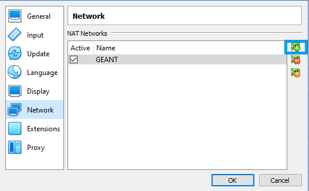
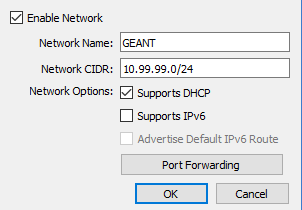
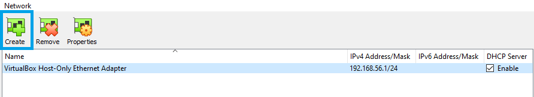
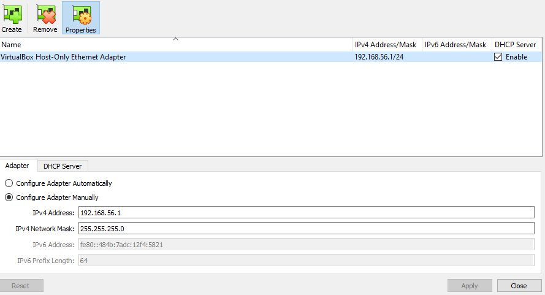
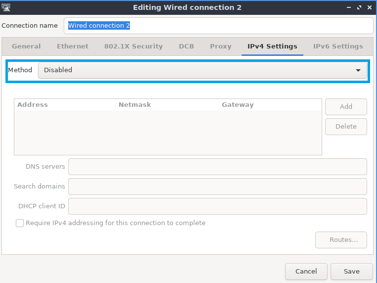

# Part 1: Deploying a Local Kubernetes Cluster

This tutorial will assume that NMaaS is installed in a virtual machine that is completely isolated from any production environment. However, the discussed steps are applicable to bare-metal hardware as well, once the correct network strategy has been identified by the system administrator.

## Virtual Machine Prerequisites 

- Ubuntu >= 20.04 Server or any Desktop flavor
- 12GB+ RAM
- 2+ VCPUs
- 60GB+ storage space

## Virtual Machine Setup

Although we will focus on VirtualBox, any virtualization software can be used, depending on the user's preference. Virtualbox 6 is an open-source virtualization software which can be downloaded for free from the [official website](https://www.virtualbox.org/wiki/Downloads).

After installation, additional network configuration needs to be done before a Kubernetes cluster can be set up. The following network configuration creates a completely isolated network environment from the production network. NMaaS will only be accessible from the host operating system where the virtual machine is deployed. 

Our virtual machine will need three network interfaces in total:

- 3 NAT type network adapters (from the same NAT network) which are created manually in Virtualbox (one for Kubernetes, two for freeRTR)
- **Optional:** 1 Host-only type network adapter which is also created manually in Virtualbox - for accessing the NAT network from the host system. Using this approach, the NMaaS instance deployed inside the virtual machine will be made accessible by adding a custom route on the host operating system towards the NAT network, traversing the host-only interfaces.

DHCP should not be enabled for the second or third NAT interfaces, but DHCP should be enabled for the first NAT interface. If an optional host interface has been added, DHCP should be enabled on it as well.

Detailed description of the required configuration steps is given below.

### Creating a New NAT Network in Virtualbox

- Navigate to `File -> Preferences -> Network` and click the Plus button on the right hand side.

    

- Once added, click on the cog icon to configure the newly created network. Alter the network name as desired, and enter a preferred CIDR. Make sure that the `Supports DHCP` option is checked.

    

- If the pre-prepared NMaaS VirtualBox image is used, make sure to select the exact same Network CIDR (10.99.99.0/24) since all NMaaS components have already been installed and expect addresses in the 10.99.99.0/24 range.

### Optional: Creating a New Host-Only Network in Virtualbox

If the NMaaS installation needs to be accessible from other networks, one option is to add a Host-Only interface to the virtual machine that will act as a transit between the outside networks and the internal VirtualBox NAT network configured in the previous step.

- Navigate to `File -> Host Network Manager` and click on the green `Create` Button.

    

- Select the Configure Adapter Manually radio button and enter the IP address that will be allocated to the host interface connected to the hypervisor along with an appropriate network mask. **Make sure that the selected range does not overlap with any existing network or the previously created NAT network.**

    

### Creating the Virtual Machine in VirtualBox

Create a regular virtual machine in VirtualBox, using the latest Ubuntu 20.04 ISO. The following parameters need to be altered:

- Allocate sufficient memory to the virtual machine. 12GB is the minimum amount which will support a complete NMaaS installation, along with the possibility for deploying additional applications via the catalog.
- Allocate sufficient number of CPU cores, depending on the performance of your system.
- In the `Network` configuration tab, add three adapters:
    - Adapter 1: NAT Network (Select the network created [previously](./p1_local-kubernetes-cluster.md#creating-a-new-nat-network-in-virtualbox))
    - Adapter 2: NAT Network (Select the network created [previously](./p1_local-kubernetes-cluster.md#creating-a-new-nat-network-in-virtualbox))
    - Adapter 3: NAT Network (Select the network created [previously](./p1_local-kubernetes-cluster.md#creating-a-new-nat-network-in-virtualbox))
- **Optional:** Adapter 4: Host-only Adapter (Select the network created [previously](./p1_local-kubernetes-cluster.md#optional-creating-a-new-host-only-network-in-virtualbox))
- If a Desktop version of Ubuntu is being installed, make sure to enable 3D acceleration in the `Display` tab.

### Configuring the Guest Operating System

Once the guest operating system has been installed, DHCP should be manually disabled on the second and third NAT interfaces. In case of an Ubuntu Server installation, this can be done by editing the Netplan configuration, located in `/etc/netplan/00-installer-config.yaml`:

```yaml title="/etc/netplan/00-installer-config.yaml"
network:
  ethernets:
...
    enp0s8:
      dhcp4: false
...
  version: 2
```

Make sure to execute `sudo netplan apply` so that the new changes will take effect.

Desktop editions of Ubuntu usually come with their own GUI network manager, so the interface status should be set to `Disabled`:



**Optional:** In case a host-only interface has been added to the virtual machine, create a route on your host operating system towards the NAT network via the host-only network interface. Examples are given below both for Microsoft Windows and GNU/Linux host operating systems below.

```powershell title="Microsoft Windows"
route add <NAT_NETWORK> mask <SUBNET_MASK> <VIRTUALBOX_HOST_NETWORK_IP>
# Using the examples above, the command would be:
# route add 10.99.99.0 mask 255.255.255.0 192.168.56.1
```

```bash title="GNU/Linux"
ip route add <NAT_NETWORK>/<CIDR_PREFIX> via <VIRTUALBOX_HOST_NETWORK_IP>
# Using the examples above, the command would be:
# ip route add 10.99.99.0/24 via 192.168.56.1
```

## Kubernetes Cluster Setup

In this section we discuss two quick methods of setting up a local Kubernetes cluster.

### Option 1: MicroK8s Installation

MicroK8s is a snap-based application that can setup a fully functional Kubernetes cluster by executing a single command. It also supports many popular addons which can also be enabled very easily.

MicroK8s abstracts away many Kubernetes configuration steps, especially when using the addon system. This can be seen as either an advantage or a disadvantage. 

- Install the MicroK8s snap, using the 1.20 version:

    ```bash
    sudo snap install microk8s --classic --channel=1.20/stable
    ```

- Add the current user to the `microk8s` group so that access to the `microk8s` command is unrestricted:

    ```bash
    sudo usermod -a -G microk8s $USER
    sudo chown -f -R $USER ~/.kube
    su - $USER
    ```

- Wait until everything is ready:

    ```bash
    microk8s status --wait-ready
    ```

- Manually check the node status and the list of running pods:

    ```bash
    microk8s kubectl get node
    microk8s kubectl get pod --all-namespaces
    ```

#### Addons Setup

##### CNI

Calico comes installed by default, no further manual configuration is required.

##### DNS

To enable CoreDNS the following command should be executed:

```bash
microk8s enable dns
```

By default the Google DNS servers will be used as upstreams (8.8.8.8 and 8.8.4.4). If there is a local DNS server available that should be used instead, it can be specified using semicolons:

```bash
microk8s enable dns:192.168.1.1
```

Once the command is executed, all of the necessary Kubernetes resources are immediately created and the associated pods brought up:

```bash
microk8s kubectl get pod -n kube-system
 
# NAME                                      READY   STATUS    RESTARTS   AGE
# calico-node-gvlsm                         1/1     Running   0          8m39s
# coredns-86f78bb79c-zhn7p                  1/1     Running   0          74s
# calico-kube-controllers-847c8c99d-vrlm2   1/1     Running   0          8m42s
```

##### Testing DNS Resolution

Testing the DNS resolution is an optional, but recommended step to ensure that the deployed CoreDNS instance is functioning properly. To do so, an instance of `dnsutils` can be deployed:

```bash
microk8s kubectl apply -f https://k8s.io/examples/admin/dns/dnsutils.yaml
```

Once the Pod enters a ready state, we can open a shell session:

```bash
microk8s kubectl exec -it dnsutils -- /bin/sh
ping geant.org
```

##### Storage

A local path provisioner can be enabled using:

```bash
microk8s enable storage
```

Beware when using this in clusters with more than one node.

##### MetalLB

MetalLB is a Kubernetes LoadBalancer implementation. 

```bash
microk8s enable metallb:192.168.99.150-192.168.99.200
```

Pick a free range from the local address space for easiest access during testing.

##### Ingress Nginx

Ingress Nginx is a popular Ingress controller for Kubernetes, based on the widely used Nginx web server.

```bash
microk8s enable ingress
```

To make the newly deployed ingress accessible from outside the CNI network, a LoadBalancer Service can be created with an address assigned by MetalLB:

```yaml title="ingress-lb.yaml"
apiVersion: v1
kind: Service
metadata:
  name: ingress
  namespace: ingress
spec:
  selector:
    name: nginx-ingress-microk8s
  type: LoadBalancer
  ports:
    - name: http
      protocol: TCP
      port: 80
      targetPort: 80
    - name: https
      protocol: TCP
      port: 443
      targetPort: 443
```

```bash
microk8s kubectl create -f ingress-lb.yaml --save-config
microk8s kubectl get service -n ingress
```

Once the assigned IP to the LoadBalancer Service has been acquired by executing the previous command, a browser window can be opened on the local workstation so as to perform a test access to the Ingress Controller. A generic `404 not found` message should be displayed.

##### Helm

Helm is a package manager for Kubernetes allowing seamless installation of complex application. NMaaS and all of its dependencies have also been packaged as Helm charts, thus easing their deployment process.

```bash
microk8s enable helm3
```

Similarly to the way that the kubectl client is accessed, Helm can be invoked using:

```bash

microk8s helm3 <HELM_COMMAND>
# for example:
microk8s helm3 list --all-namespaces
```

!!! danger "Helm Version"

    Unfortunately, the Helm version installed in this manner, as an official MicroK8s addon is too old. A newer version, if needed, can be installed by following the instructions available below. **Please note that the GitLab chart, which is a dependency of NMaaS requires a newer Helm version than the one installed as a MicroK8s addon.**

###### Installing a Newer Helm Version

- Download the latest Helm release from [https://github.com/helm/helm/releases](https://github.com/helm/helm/releases) for your architecture (e.g. [https://get.helm.sh/helm-v3.7.0-linux-amd64.tar.gz](https://get.helm.sh/helm-v3.7.0-linux-amd64.tar.gz)).
- Unpack the downloaded archive file and move it to a location in `PATH`.

    ```bash
    wget https://get.helm.sh/helm-v3.7.0-linux-amd64.tar.gz -O helm-latest.tar.gz
    tar -xvzf helm-latest.tar.gz
    mv linux-amd64/helm /usr/local/bin
    chmod +x /usr/local/bin/helm
    ```

- Finally, the kube config to interact with the MicroK8s Kubernetes cluster needs to be copied to the appropriate location:

    ```bash
    microk8s.config > ~/.kube/config
    ```

### Option 2: K3s Installation

K3s is another easy way to configure a full-fledged Kubernetes cluster in a matter of minutes. K3s is more lightweight than other Kubernetes distributions since it does not ship with unnecessary modules, such as the ones for integrating with various cloud providers. K3s offers seamless scalability across multiple nodes and provides the ability to either use an embedded database for storing the cluster state or a relational one, such as PostgreSQL or MySQL.

- K3s can be installed with the following command:

    ```bash
    export INSTALL_K3S_VERSION=v1.20.14+k3s2
    curl -sfL https://get.k3s.io | sh -s - server \
    --tls-san demo.nmaas.local \
    --tls-san 10.99.99.100 \
    --disable=traefik \
    --flannel-backend=none \
    --disable-network-policy \
    --disable=servicelb \
    --write-kubeconfig-mode 664 \
    --cluster-cidr=10.136.0.0/16
    ```

    - `--tls-san` – can be specified multiple times to add additional names for which the automatically generated Kubernetes API certificates will be valid. **Make sure to replace the IP address with the IP address of your VM**.
    - `--disable=traefik` – Traefik needs to be explicitly disabled since it ships by default with new K3s installations. We will use ingress-nginx as our ingress controller and will install it manually in a later step.
    - `--flannel-backend=none` – Flannel CNI needs to be explicitly disabled, since we will manually install Calico.
    - `--disable-network-policy` – we do not need the default network policy addon that enabled the use of Kubernetes NetworkPolicy objects, since Calico has built-in support for network policies.
    - `--disable=servicelb` – the preconfigured implementation for LoadBalancer service objects should be disabled, since we will manually install MetalLB.
    - `--write-kubeconfig-mode 664` – more permissive permissions are needed for the automatically generated kubeconfig file so that regular users, apart from root, can use the kubectl client as well.
    - `--clister-cidr=10.136.0.0/16` – a free subnet range which will be used as the pod network. Should be written down since it will be required in the Calico deployment as well.

- Another way of providing `kubectl` access to different users is to make a copy of the original kubeconfig file located in `/etc/rancher/k3s/k3s.yaml` into a directory and changing its permissions. Then, by exporting the `KUBECONFIG` environment variable, the kubectl client will be forced to use the newly created configuration:

    ```bash
    export KUBECONFIG=~/.kube/config
    ```

- Our cluster is still not in a Ready state, since we do not have a CNI plugin installed yet.

    ```bash
    kubectl get node -o wide
    ```

#### Addons Setup

##### CNI

- Calico can be manually installed by downloading the manifest file and setting the CALICO_IPV4POOL_CIDR parameter to the value set when deploying K3s.

    ```bash
    mkdir -p ~/manifests/calico
    cd ~/manifests/calico
    wget https://docs.projectcalico.org/manifests/calico.yaml
    nano calico.yaml
    ```

    ```yaml title="calico.yaml"
    ...
                # The default IPv4 pool to create on startup if none exists. Pod IPs will be
                # chosen from this range. Changing this value after installation will have
                # no effect. This should fall within `--cluster-cidr`.
                - name: CALICO_IPV4POOL_CIDR
                value: "10.136.0.0/16"
                # Disable file logging so `kubectl logs` works.
    ...
    ```

    ```bash
    kubectl create -f calico.yaml --save-config
    ```

- Once Calico has been installed, the node should transition to a `Ready` state.

    ```bash
    kubectl get node -o wide
    ```

##### DNS

CoreDNS is installed by default with K3s, so no need for any manual installation or configuration. Once Calico CNI has been deployed and the cluster has entered a `Ready` state, DNS resolution can be tested using the `dnsutil` pod, as described in the official Kubernetes documentation page.

```bash
kubectl apply -f https://k8s.io/examples/admin/dns/dnsutils.yaml
```

Once the Pod enters a ready state, we can open a shell session:

```bash
kubectl exec -it dnsutils -- /bin/sh
ping geant.org
```

##### Storage

An instance of local path provisioner is automatically installed when deploying K3s, which is sufficient for development single-node clusters such as ours.

```bash
# kubectl get storageclass
NAME                   PROVISIONER             RECLAIMPOLICY   VOLUMEBINDINGMODE      ALLOWVOLUMEEXPANSION   AGE
local-path (default)   rancher.io/local-path   Delete          WaitForFirstConsumer   false                  45h
```

##### MetalLB

MetalLB can be installed using the official Kubernetes manifests.

- To install MetalLB, first the `metallb-system` namespace must be created:

    ```bash
    kubectl apply -f https://raw.githubusercontent.com/metallb/metallb/v0.11.0/manifests/namespace.yaml
    ```

- Once the namespace has been created, it can be populated with all of the other necessary components:

    ```bash
    kubectl apply -f https://raw.githubusercontent.com/metallb/metallb/v0.11.0/manifests/metallb.yaml
    ```

- Finally, a default configuration ConfigMap should be created, describing the address range allocated to MetalLB. Please make sure to select an unused block of space. In our case, we will use addresses `10.99.99.150` to `10.99.99.200` from the GEANT NAT network which we configured in VirtualBox at the start of the guide.

    ```yaml title="metallb-config.yaml"
    apiVersion: v1
    kind: ConfigMap
    metadata:
    namespace: metallb-system
    name: config
    data:
    config: |
        address-pools:
        - name: default
        protocol: layer2
        addresses:
        - 10.99.99.150-10.99.99.200
    ```

    ```bash
    kubectl create -f metallb-config.yaml --save-config
    ```

##### Helm

To install Helm, we need to first download the latest binary for our architecture and extract it to a location which is in the `PATH` system variable.

- Visit [https://github.com/helm/helm/releases](https://github.com/helm/helm/releases) and copy the download link for the latest release.
- Download the latest release locally

    ```bash
    cd $(mktemp -d)
    wget https://get.helm.sh/helm-v3.7.1-linux-amd64.tar.gz
    tar -xvzf helm-v3.7.1-linux-amd64.tar.gz
    sudo mv helm /usr/local/bin/helm
    ```

- Test whether Helm has been successfully installed by executing `helm version`.

##### Ingress Nginx

The last application that needs to be installed before we can move on to installing the NMaaS components is Ingress Nginx. Since we have already configured Helm, the Ingress Nginx installation is simple.

- Customize the values.yaml file according to the local environment:

    ```yaml title="ingress-values.yaml"
    defaultBackend:
    enabled: true
    controller:
        config:
            log-format-upstream: '{"time": "$time_iso8601", "remote_addr": "$proxy_protocol_addr", "x-forward-for": "$proxy_add_x_forwarded_for", "request_id": "$req_id", "remote_user": "$remote_user", "bytes_sent": $bytes_sent, "request_time": $request_time, "status":$status, "vhost": "$host", "request_proto": "$server_protocol", "path": "$uri", "request_query": "$args", "request_length": $request_length, "duration": $request_time,"method": "$request_method", "http_referrer": "$http_referer", "http_user_agent": "$http_user_agent" }'
        kind: Deployment
        ingressClass: nginx
        scope:
            enabled: false
            namespace: default
        service:
            type: LoadBalancer
        metrics:
            enabled: false
    ```

    In our case we have opted to use a Deployment instead of a DaemonSet for the deployment strategy. Additionally, we have selected a service type of LoadBalancer since we have already installed MetalLB and it is ready to allocate an IP address to our LoadBalancer service.

- Add the `ingress-nginx` Helm repository and install the application:

    ```bash    
    helm repo add ingress-nginx https://kubernetes.github.io/ingress-nginx
    helm repo update
    kubectl create namespace nmaas-system
    helm install -f ingress-values.yaml --namespace nmaas-system nmaas-ingress ingress-nginx/ingress-nginx
    ```

    We have chosen to install `ingress-nginx` in the `nmaas-system` namespace, which will house all the other NMaaS components as well.

    !!! danger "Note About Helm Errors"
        
        When running the helm install command, Helm might throw an error about the cluster being unreachable. This is most likely because Helm looks for the kube.config file in the default location, but `--write-kubeconfig-mode 664` has been specified during the K3s installation, and the actual location is `/etc/rancher/k3s/k3s.yaml`.

        This can be fixed by simply executing:

        ```bash
        export KUBECONFIG='/etc/rancher/k3s/k3s.yaml'
        ```

- We can test the installed ingress by directly visiting the allocated LoadBalancer IP address in a browser. We should be presented with a generic `404-not found` page.

    ```bash
    kubectl get service -n nmaas-system
    curl --insecure https://10.99.99.150
    ```