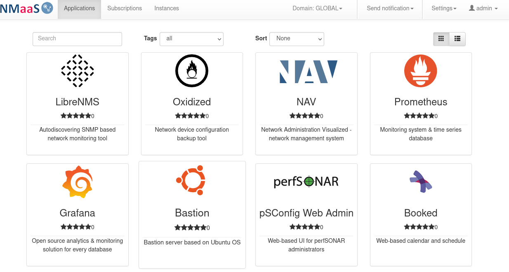

# Part 2: Installing nmaas

Once a working Kubernetes cluster has been deployed, we are ready to proceed to the next step - installing nmaas.

All the necessary components will be installed in a single namespace – `nmaas-system`. If this namespace has not been created so far, execute:

```bash
kubectl create namespace nmaas-system
```

## GitLab Installation

The first nmaas dependency that we will set up is GitLab, a self-hosted web based Git repository hosting service. Many applications that are deployed by nmaas users store their configuration data in a Git repository, allowing easier editing, and version management.

GitLab has an official Helm chart, and we will use it to create a basic GitLab installation locally. Some parameters must be customized in the values.yaml file before deployment:

- `global.hosts.domain` – should be set to the domain that will be allocated to GitLab. Note that the final hostname where GitLab will be reachable will have a `gitlab` prepended to it. If `nmaas.example.local` is set as the `global.hosts.domain` parameter, then GitLab will be available on `gitlab.nmaas.example.local`.
- `global.hosts.ssh` – in order for users to be able to interact with their GitLab repositories via SSH, the value of `global.hosts.ssh` should be set to the MetalLB IP that will be assigned to this new service (usually the next available one) for the gitlab-shell component. If the IP is not known at the time of deployment, then after the initial deployment, once the LoadBalancer service is created and the IP is allocated, a chart upgrade can be performed, where the `global.hosts.ssh` parameter will be set to the appropriate value.
- `global.ingress.tls.secretName` – an existing Kubernetes TLS secret where the TLS certificate to be used is stored.
- `global.ingress.annotations.kubernetes.io/ingress.class` – should be set to the ingress class used by the deployed ingress-nginx instance. In case of MicroK8s this should be set to public. In case of K3s, it should be set to `nginx`.
- optionally, if an email server is available, the `global.smtp` section can be edited with the appropriate parameters so that outbound email is enabled.

```yaml title="gitlab-values.yaml"
certmanager:
  install: false
nginx-ingress:
  enabled: false
prometheus:
  install: false
redis:
  install: true
postgresql:
  postgresqlUsername: gitlab
  install: true
  postgresqlDatabase: gitlabhq_production
  usePasswordFile: false
  existingSecret: 'gitlab-postgresql'
  master:
    extraVolumeMounts:
      - name: custom-init-scripts
        mountPath: /docker-entrypoint-preinitdb.d/init_revision.sh
        subPath: init_revision.sh
    podAnnotations:
      postgresql.gitlab/init-revision: "1"
  metrics:
    enabled: false
gitlab-runner:
  install: false
gitlab-shell:
  service:
    type: LoadBalancer
global:
  edition: ce
  hosts:
    domain: nmaas.<INGRESS_IP>.nip.io
    https: true
    ssh: <LB_SSH_IP>.nip.io
  ingress:
    enabled: true
    configureCertmanager: false
    tls:
      enabled: true
      # secretName: <EXISTING_OR_DUMMY_TLS_SECRET_NAME> # can be left empty, self-signed certificates will be generated
    path: /
    class: "nginx"
  initialRootPassword:
    secret: gitlab-root-password
    key: password
  appConfig:
    defaultProjectFeatures:
      builds: false
  time_zone: Europe/Warsaw
  smtp:
    enabled: false
    address: smtp.example.com
    port: 587
    user_name: ""
    ## doc/installation/secrets.md#smtp-password
    password:
      secret: "my-smtp-secret"
      key: password
    # domain:
    authentication: "login"
    starttls_auto: true
    openssl_verify_mode: "peer"
## doc/installation/deployment.md#outgoing-email
## Email persona used in email sent by GitLab
  email:
    from: 'noreply@example.com'
    display_name: GitLab
    reply_to: 'support@example.com'
    smime:
      enabled: false
```

GitLab requires the deployment of a PostgreSQL instance. The necessary secrets containing the PostgreSQL passwords need to be created, as well as the secret containing the initial root GitLab password:

```bash
export NMAAS_NAMESPACE="nmaas-system"
kubectl create secret generic -n $NMAAS_NAMESPACE gitlab-postgresql --from-literal=postgresql-password=<POSTGRESQL_USER_PASSWORD> --from-literal=postgresql-postgres-password=<POSTGRESQL_ROOT_PASSWORD>
kubectl create secret generic -n $NMAAS_NAMESPACE gitlab-root-password --from-literal=password=<GITLAB_ROOT_PASSWORD>
```

The root GitLab password will be used for login to the GitLab web interface.

We are ready to add the GitLab Helm repository and install the 8.2.x version of GitLab:

```bash
helm repo add gitlab https://charts.gitlab.io
helm repo update
helm install -f gitlab-values.yaml --namespace nmaas-system nmaas-gitlab --version 8.2.0 gitlab/gitlab
```

Once GitLab has been deployed, it should be possible to navigate to the login page using a web browser. After logging in, users are advised to configure the following settings:

- disable new user registrations (`Admin Area -> Settings -> General -> Sign-up restrictions`)
    - `Sign-up enabled` should be unchecked
    - `Require admin approval for new sign-ups` should be unchecked
- enable webhooks to local addresses (`Admin Area -> Settings -> Network -> Outbound requests`)
    - `Allow requests to the local network from web hooks and services` = checked
    - `Allow requests to the local network from system hooks` = checked

The final step before installing nmaas itself is to generate a GitLab personal access token which will allow nmaas to connect to the GitLab API. This can be done from the User Profile page:

    - Click on the user avatar in the right-hand corner of the screen, Edit Profile. Select Access Tokens from the left-hand navigation menu. Give a new name for the authentication token, as well as an optional expiry date. Check all scopes.
    - Store the token until the next section, where we will create a new secret containing it.

## nmaas Installation

The final step is to install nmaas. nmaas uses SSH communication to connect between components, so we need to create an SSH key pair and store it in a Kubernetes secret. This can be done by executing the following commands:

```bash
#!/bin/bash
export NMAAS_NAMESPACE="nmaas-system"
tmpdir=$(mktemp -d)
ssh-keygen -f $tmpdir/key -N ""
  
# nmaas-helm-key-private should be replaced with {{ .Values.global.helmAccessKeyPrivate }}
kubectl create secret generic nmaas-helm-key-private -n $NMAAS_NAMESPACE --from-file=id_rsa=$tmpdir/key
  
# nmaas-helm-key-private should be replaced with {{ .Values.global.helmAccessKeyPublic }}
kubectl create secret generic nmaas-helm-key-public -n $NMAAS_NAMESPACE --from-file=helm=$tmpdir/key.pub
```

A few parameters need to be customized in the values.yaml file, to reflect the environment where nmaas is deployed.

- `global.wildcardCertificateName` – the name of the secret containing the TLS certificate to be used to secure the HTTP communication
- `global.nmaasDomain` – the hostname where nmaas will be accessible.
- `global.gitlabApiUrl` - the API endpoint for GitLab
- `global.gitlabApiToken.literal` - the value of the personal access token created previously in GitLab.
- `platform.properties.adminEmail` – the email address which will receive various notifications such as new user sign-up, deployment errors, new application versions...
- `platform.adminPassword.literal` – the password used to login as the admin user in the nmaas Portal.
- `platform.properties.k8s.ingress.certificate.issuerOrWildcardName` – the name of the wilcard certificate to be used for customer deployed applications, or the name of the cert-manager issuer to use if certificates are issued ad-hoc.
- `platform.properties.k8s.ingress.controller.ingressClass` – the ingress class to be used for deployed applications. Should be set to nginx in the case of K3s and public in the case of MicroK8s.
- `platform.properties.k8s.ingress.controller.publicIngressClass` – the ingress class to be used for applications where the users have explicitly selected to enable public access (e.g. without a VPN). Since this is a local deployment, the value of this parameter should equal the value set in `platform.properties.k8s.ingress.controller.ingressClass`.
- `publicServiceDomain`, `externalServiceDomain` – for a local deployment this parameter should be set to the same value as `global.nmaasDomain`.

```yaml title="nmaas-values.yaml"
global:
  acmeIssuer: false
  demoDeployment: true
  ingressName: nmaas
  nmaasDomain: nmaas.<INGRESS_IP>.nip.io
  wildcardCertificateName: <EXISTING_OR_DUMMY_TLS_SECRET_NAME>
  gitlabApiUrl: 'http://nmaas-gitlab-webservice-default:8181/api/v4'
  gitlabApiToken:
    literal: <GITLAB_ACCESS_TOKEN>
platform:
  ingress:
    className: nginx
  adminPassword:
    literal: saamn
  apiSecret:
    literal: saamn
  initscripts:
    enabled: true
  properties:
    autoNamespaceCreationForDomains: true
    sso:
      encrpytionSecret:
        literal: saamn
    adminEmail: noreply@nmaas.local
    appInstanceFailureEmailList: noreply@nmaas.local
    k8s:
      ingress:
        certificate:
          issuerOrWildcardName: <EXISTING_OR_DUMMY_TLS_SECRET_NAME>
        controller:
          ingressClass: nmaas
          publicIngresClass: nmaas
          publicServiceDomain: nmaas.<INGRESS_IP>.nip.io
          externalServiceDomain: nmaas.<INGRESS_IP>.nip.io
```

Once the values.yaml file has been customized, nmaas can be deployed by executing:

```bash
helm repo add nmaas https://artifactory.software.geant.org/artifactory/nmaas-helm
helm install -f nmaas-values.yaml --namespace nmaas-system nmaas --version 1.2.11 nmaas/nmaas
```

nmaas also requires an the stakater autoreloader component, which can simply be installed using the commands below. This component takes care of restarting the affected pods whenever a configuration change is submitted via GitLab.

```bash
helm repo add stakater https://stakater.github.io/stakater-charts
helm repo update
helm install config-reload --namespace nmaas-system stakater/reloader
```

After the installation, login as the `admin` user should be possible with the configured password.

