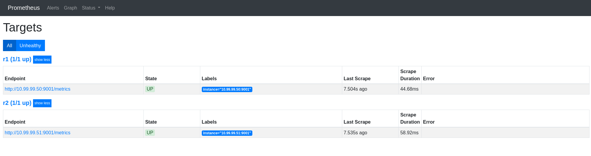

# Part 4: Monitoring the Demo Network Environment with NMaaS

## Registering a new Local NMaaS User

Registering a new local NMaaS user can be done from the NMaaS homepage.


Once all of the required fields (denoted by a red *) are filled, and the privacy policy accepted, the registration form can be submitted.

After submission, an administrator approval is required before being able to login.

### Approving the New User (as Admin) and Creating a New Domain

To approve a newly registered user, login as the NMaaS admin, and navigate to `Settings -> Users` from the right-hand side navigation menu. Hover over the cog next to the new user and select `Enable`.


Once enabled, the user should be made part of an existing domain. Since we currently have not configured any domains, a new one needs to be created.

- Navigate to `Settings -> Domains` from the right-hand side navigation menu.
- Click the blue `Add domain` button
- Enter a descriptive name for the domain, as well as a short codename. Please keep the codename as short as possible, since it will be embedded in all customer deployed Kubernetes resources.
- Choose which Kubernetes namespace will be dedicated to hosting the customer deployed applications. A new namespace can be created by executing:

    ```bash
    kubectl create namespace <DOMAIN_CODENAME>
    ```

- For a local deployment, leave the Kubernetes storage class field empty, and set Kubernetes Ingress class to the ingress class available in the cluster (public for MicroK8s, nginx for K3s)
- As External service domain set the domain codename, suffixed by the NMaaS URL. For example, if the domain codename is demo, then External service domain should be set to `demo.nmaas.<INGRESS_LB_IP>.nip.io`.
- Set the DCN deployment type to `Manual` and tick `DCN Configured`.
- Set a dummy customer network, for example `127.0.0.1/24`.

    

Once created, any existing user can be made part of the domain. Return to `Settings -> Users` and choose the `Details` option after hovering over the cog for the new user. In the `Privileges` section, assign the role `Domain admin` to the newly created user.


## Adding a Personal SSH Public Key

After the user has been approved, if email sending has been successfully configured, the user should receive a confirmation message.

During the first login, the user will be asked to enter an SSH public key which will be used for access to the GitLab repositories hosting the deployed applications' configuration files. An SSH key can also be specified at any later point in time from the `Profile -> SSH keys` section.


Please add an SSH public key before proceeding to the next section, Application Deployment.

## Application Deployment

The application deployment process is consisted of two parts:

1. Subscribing to the desired application from the list of all applications.

    

2. Deploying an instance of the application from the Subscriptions page.

    

### Deploying Prometheus

Prometheus is a monitoring application which uses the pull methodology to fetch metrics from a given device. 

To deploy Prometheus, first subscribe to it from the Applications section. Then choose the `Deploy` option.

On the first pop-up, an option is presented to enter a unique instance name, as well as select the desired application version.

The deployment process consists of 6 different steps, but only step 4, Application deployed, requires user interaction. Once step 4 has been reached, a blue `Configure` button will appear.


Clicking on this blue `Configure` button will present a configuration wizard, where additional parameters can be set.


The configuration wizard is specific to the application being deployed. In the case of Prometheus, there is an option to configure the HTTP Basic authentication username and password, as well as the scrape interval. The IP addresses of the devices that need to be monitored can be specified in the Jobs array. Note that the demo networking devices deployed in the previous step can also be monitored. They have a Prometheus exporter running on port 9001, reachable without any authentication. Additional devices can be added after the application has been deployed by using the Git repository which will host the configuration.

After the application is successfully deployed, it will transition to an Active state, and a blue `Actions` button will become available. By selecting the Access option in this dropdown menu, the user will be immediately redirected to the Prometheus home page.




### Deploying Grafana

By now we have configured Prometheus to monitor the devices in our environment, but we still do not have a way to visualize the gathered metrics. 

Grafana is an open-source application that can generate graphs from different data sources, including Prometheus.

To deploy Grafana in an NMaaS environment, the same general steps can be used as before:

- subscribing to the Grafana application from the Applications page
- creating a new instance from the Subscriptions page


The configuration wizard that becomes available once the deployment enters the Deployed phase is different in the case of Grafana. Apart from specifying the Grafana username and password that can be used for accessing the web interface, users have the option of directly choosing an existing Prometheus instance that has been deployed within their NMaaS domain, and adding it as a data source to Grafana. This can be accomplished by ticking the `Connect to existing Prometheus instance` checkbox, and selecting the `NMaaS Prometheus Instance` radio button.


Of course, a Grafana instance hosted on NMaaS can be used for connecting to external data sources as well. In this case, the checkbox `Connect to existing Prometheus instance` can simply be left unchecked. 

Once the application is deployed, it can be accessed by selecting the `Actions -> Access` button. After login, users can verify that the previously deployed Prometheus instance has been added as a Data Source by selecting the cog icon on the left hand side and choosing `Data Sources`.


At this point, new dashboards can either be created from scratch, or imported from the Grafana dashboard gallery. 

For example, if the freeRTR virtual instances are deployed, the following two dashboards can be imported to visualize the packet and input/output rates of the devices:

- https://grafana.com/grafana/dashboards/13152
- https://grafana.com/grafana/dashboards/13153 

An existing dashboard can be imported into Grafana by simply choosing the Plus button on the left-hand side and selecting Import.


Either a JSON document describing the parameters of the dashboard can be pasted or just the dashboard ID, as shown on the official Grafana page.


In our case, the IDs for the two previously mentioned dashboards are `13152` and `13153`, respectively. This information is also directly visible in their URL.

After importing the dashboard, a redirect is immediately issued, and the defined graphs are shown.


### Deploying Oxidized

Oxidized is an open-source application that is capable of fetching the configuration of remote devices and if enabled, version it using an internal or external Git repository.

In our demo scenario, we will use Oxidized to periodically fetch the configuration from the available network elements. To do so, we must first deploy Oxidized in our NMaaS domain. 

The deployment steps for Oxidized are very similar to the other applications that have been deployed so far:

- Subscribe to the Oxidized application from the `Applications` page.
- Deploy an Oxidized instance from the `Subscriptions` page.


Once the `Deploy` button is clicked, a pop-up similar as before appears, where an instance name should be provided, and the desired Oxidized version selected.


Since Oxidized can connect to devices using a remote access protocol such as Telnet or SSH, the configuration wizard asks for IP information. Additionally, HTTP Basic authentication can also be configured to better secure the Oxidized web interface, using the Oxidized `access username` and Oxidized `access password` fields.


Once deployed, the web interface becomes immediately accessible, simply by choosing the blue `Actions` button and selecting `Access`.

Additional Oxidized configuration, such as altering the list of monitored devices or even adding custom Oxidized models can be done using Git. During the deployment process, a new GitLab repository has been automatically created which hosts the Oxidized configuration data. To access it, select `Actions -> Configure` and copy the `git clone` command.


After cloning this repository, two folders should appear: `base` and `model`.

The base folder houses basic configuration about the monitored devices:

- `router.db` – hostnames, IP addresses, and groups for the devices
- `config` – storage backend, backup storage location, credentials...

The `model` folder houses specific device models, which describe how Oxidized should connect to the monitored devices and what commands to execute in order to acquire the running configuration.

The RARE team has created a custom Oxidized model which allows configuration fetching from FreeRTR devices. If you have configured freeRTR as part of this tutorial, then this model is required for successful connections towards the freeRTR instances.

#### Monitoring freeRTR Devices with Oxidized

After cloning the repository, navigate to the `model` folder and create the file `rare.rb` wth the following content:

```rb title="rare.rb"
class RARE < Oxidized::Model
  prompt /([\w.@()-]+#\s?)$/
  comment '! '
  cmd :all do |cfg|
    cfg.gsub! /^% Invalid input detected at '\^' marker\.$|^\s+\^$/, ''
    cfg.cut_both
  end
  cmd :secret do |cfg|
    cfg
  end
  cmd 'show clock' do |cfg|
    comment "---------- show clock"
    comment cfg
  end
  cmd 'show platform' do |cfg|
    comment "---------- show platform"
    comments = []
    comments << cfg.lines.first
    lines = cfg.lines
    lines.each_with_index do |line, i|
      if line !~ /^mem:|^uptime:/
        comments << line.strip!
      end
    end
    comments << "\n"
    comment comments.join "\n"
  end
  cmd 'show interfaces description' do |cfg|
    comment "---------- show interface description"
    comment cfg
  end
  cmd 'show startup-config' do |cfg|
    comment "---------- show startup-config"
    cfg = cfg.each_line.to_a[0..-1]
    cfg = cfg.reject { |line| line.match /^ntp clock-period / }.join
    cfg.gsub! /^Current configuration : [^\n]*\n/, ''
    cfg.gsub! /^ tunnel mpls traffic-eng bandwidth[^\n]*\n*(
                  (?: [^\n]*\n*)*
                  tunnel mpls traffic-eng auto-bw)/mx, '\1'
    cfg
  end
  cfg :telnet do
    username /^Username:/i
    password /^Password:/i
  end
  cfg :telnet, :ssh do
    # preferred way to handle additional passwords
    post_login do
      if vars(:enable) == true
        cmd "enable"
      elsif vars(:enable)
        cmd "enable", /^[pP]assword:/
        cmd vars(:enable)
      end
    end
    post_login 'terminal length 0'
    post_login 'terminal width 0'
    pre_logout 'exit'
  end
end
```

After adding the model, it must also be referenced in the `base/config` file, where the format of the `router.db` file can be altered as well.

```yaml title="config"
---                                                                                                                                                                                                                                                         
username: root                                                                                                                                                                                                                                              
password: root                                                                                                                                                                                                                                              
model: rare                                                                                                                                                                                                                                                 
interval: 43200                                                                                                                                                                                                                                             
use_syslog: false                                                                                                                                                                                                                                           
debug: false                                                                                                                                                                                                                                                
threads: 30                                                                                                                                                                                                                                                 
timeout: 20                                                                                                                                                                                                                                                 
retries: 3                                                                                                                                                                                                                                                  
prompt: !ruby/regexp /^([\w.@-]+[#>]\s?)$/                                                                                                                                                                                                                  
rest: 0.0.0.0:8888                                                                                                                                                                                                                                          
vars: {}                                                                                                                                                                                                                                                    
groups: {}                                                                                                                                                                                                                                                  
pid: "/storage/pid"                                                                                                                                                                                                                                         
input:                                                                                                                                                                                                                                                      
  default: ssh, telnet                                                                                                                                                                                                                                      
  debug: false                                                                                                                                                                                                                                              
  ssh:                                                                                                                                                                                                                                                      
    secure: false                                                                                                                                                                                                                                           
output:                                                                                                                                                                                                                                                     
  default: git                                                                                                                                                                                                                                              
  file:                                                                                                                                                                                                                                                     
    directory: "/storage/configs"                                                                                                                                                                                                                           
  git:                                                                                                                                                                                                                                                      
    user: oxidized                                                                                                                                                                                                                                          
    email: oxidized@man.poznan.pl                                                                                                                                                                                                                           
    repo: "/storage/oxidized.git"
source:
  default: csv
  csv:
    file: "/root/.config/oxidized/router.db"
    delimiter: !ruby/regexp /:/
    map:
      name: 0
      ip: 1
      model: 2
model_map:
  rare: rare
  cisco: ios
  juniper: junos
```

Note that we have altered the keys: model, source.csv.map and model_map.

By altering the source.csv.map object we can set the format of the CSV file that contains the device information. In this case, we will format our CSV file using three columns: `name`; `ip`; `model`.

Finally, alter the `base/router.db` file to reflect the changes made to the CSV format:

```text title="router.db"
r1:10.99.99.50:rare
r2:10.99.99.51:rare
```