# Part 5: Adding a Custom Application to the nmaas Catalog

Any application that has an existing Helm chart can be added to the nmaas catalog. In this example we will use the popular uptime monitoring application - [UptimeKuma](https://github.com/louislam/uptime-kuma).

The agenda is to first create a regular Helm chart, without introducing any nmaas dependencies, thus keeping it reusable across platforms. Then, we will add this Helm chart as a new application to the nmaas catalog.

## Creating a Helm Chart

nmaas does not mandate any requirements when creating Helm charts. If Helm best practices are followed, then there should not be any problem in integrating the application to the nmaas catalog.

The boilerplate code for a new Helm chart can be generated using the helm create command:

```bash
helm create nmaas-uptimekuma
```

Without going into specifics of how Helm charts are created, the source files for the nmaas-uptimekuma chart are provided below. We discuss some important aspects at the end of this section.

```yaml title="templates/_helpers.tpl"
{{/* vim: set filetype=mustache: */}}
{{/*
Expand the name of the chart.
*/}}
{{- define "name" -}}
{{- default .Chart.Name .Values.nameOverride | trunc 63 | trimSuffix "-" -}}
{{- end -}}
 
{{/*
Create a default fully qualified app name.
We truncate at 63 chars because some Kubernetes name fields are limited to this (by the DNS naming spec).
*/}}
{{- define "fullname" -}}
{{- .Release.Name | trunc 63 | trimSuffix "-" -}}
{{- end -}}
```

```yaml title="templates/ingress.yaml"
{{- if .Values.ingress.enabled -}}
{{- $serviceName := include "fullname" . -}}
{{- $servicePort := .Values.service.port -}}
{{- $kubeVersion := .Capabilities.KubeVersion.GitVersion -}}
{{- if semverCompare ">=1.19-0" $kubeVersion -}}
apiVersion: networking.k8s.io/v1
{{- else -}}
apiVersion: networking.k8s.io/v1beta1
{{- end }}
 
kind: Ingress
metadata:
  name: {{ template "fullname" . }}
  labels:
    app: {{ template "name" . }}
    chart: {{ .Chart.Name }}-{{ .Chart.Version | replace "+" "_" }}
    release: {{ .Release.Name }}
    heritage: {{ .Release.Service }}
  annotations:
    {{- if .Values.ingress.tls.acme }}
    kubernetes.io/tls-acme: "{{ .Values.ingress.tls.acme }}"
    certmanager.k8s.io/cluster-issuer: "{{ .Values.ingress.tls.certOrIssuer }}"
    {{- end }}
    kubernetes.io/ingress.class: "{{ .Values.ingress.class }}"
    nginx.ingress.kubernetes.io/proxy-read-timeout: "3600"
    nginx.ingress.kubernetes.io/proxy-send-timeout: "3600"
    nginx.ingress.kubernetes.io/server-snippets: |
      location / {
        proxy_set_header Upgrade $http_upgrade;
        proxy_http_version 1.1;
        proxy_set_header X-Forwarded-Host $http_host;
        proxy_set_header X-Forwarded-Proto $scheme;
        proxy_set_header X-Forwarded-For $remote_addr;
        proxy_set_header Host $host;
        proxy_set_header Connection "upgrade";
        proxy_set_header X-Real-IP $remote_addr;
        proxy_set_header X-Forwarded-For $proxy_add_x_forwarded_for;
        proxy_set_header   Upgrade $http_upgrade;
        proxy_cache_bypass $http_upgrade;
        }
spec:
  rules:
    {{- range $host := .Values.ingress.hosts }}
    - host: {{ $host }}
      http:
        paths:
          - path: /
            {{- if semverCompare ">=1.19-0" $kubeVersion }}
            pathType: Prefix
            backend:
              service:
                name: {{ $serviceName }}
                port:
                  number: {{ $servicePort }}
            {{- else }}     
            backend:
              serviceName: {{ $serviceName }}
              servicePort: {{ $servicePort }}
            {{- end }}
    {{- end -}}
  {{- if .Values.ingress.tls.enabled }}
  tls:
  - hosts:
    {{- range $host := .Values.ingress.hosts }}
    - {{ $host }}
    {{- end -}}
    {{- if .Values.ingress.tls.acme }}
    secretName: {{ .Release.Name }}-tls
    {{- else }}
    secretName: {{ .Values.ingress.tls.certOrIssuer }}
    {{- end }}
  {{- end -}}
{{- end -}}
```

```yaml title="templates/service.yaml"
apiVersion: v1
kind: Service
metadata:
  name: {{ template "fullname" . }}
  labels:
    app: {{ template "name" . }}
    chart: {{ .Chart.Name }}-{{ .Chart.Version | replace "+" "_" }}
    release: {{ .Release.Name }}
    heritage: {{ .Release.Service }}
    access: external
spec:
  type: {{ .Values.service.type }}
  {{- if eq .Values.service.type "ClusterIP" }}
  clusterIP: None
  {{- end }}
  ports:
  - port: {{ .Values.service.port }}
    targetPort: {{ .Values.service.targetPort }}
    protocol: TCP
    name: {{ .Values.service.name }}
  selector:
    app: {{ template "name" . }}
    release: {{ .Release.Name }}
```

```yaml title="templates/statefulset.yaml"
apiVersion: apps/v1
kind: StatefulSet
metadata:
  name: {{ template "fullname" . }}
  labels:
    app: {{ template "name" . }}
    chart: {{ .Chart.Name }}-{{ .Chart.Version | replace "+" "_" }}
    release: {{ .Release.Name }}
    heritage: {{ .Release.Service }}
spec:
  serviceName: ""
  replicas: {{ .Values.replicaCount }}
  selector:
    matchLabels:
      app: {{ template "name" . }}
      release: {{ .Release.Name }}
  template:
    metadata:
      labels:
        app: {{ template "name" . }}
        release: {{ .Release.Name }}
    spec:
      containers:
        - name: {{ .Chart.Name }}
          image: "{{ .Values.image.repository }}:{{ .Values.image.tag }}"
          imagePullPolicy: {{ .Values.image.pullPolicy }}
          ports:
            - name: http
              containerPort: 3001
              protocol: TCP
          resources:
            {{- toYaml .Values.resources | nindent 12 }}
          volumeMounts:
          - mountPath: /app/data
            name: {{ .Values.persistence.existingClaim | default (include "fullname" .) | quote }}
          livenessProbe:
            exec:
              command:
                - node
                - extra/healthcheck.js
            initialDelaySeconds: 180
            periodSeconds: 60
            timeoutSeconds: 30
          readinessProbe:
            httpGet:
              path: /
              port: 3001
              scheme: HTTP
  {{- if .Values.persistence.enabled }}
      volumes:
  {{- if .Values.persistence.existingClaim }}
        - name: {{ .Values.persistence.existingClaim | quote }}
          persistentVolumeClaim:
            claimName: {{ .Values.persistence.existingClaim | quote }}
  {{- else }}
  volumeClaimTemplates:
    - metadata:
        name: {{ include "fullname" . | quote }}
      spec:
        accessModes:
          - {{ .Values.persistence.accessMode | quote }}
        resources:
          requests:
            storage: {{ .Values.persistence.size | quote }}
        {{- if and (.Values.persistence.storageClass) (ne "-" .Values.persistence.storageClass) }}
        storageClassName: "{{ .Values.persistence.storageClass }}"
        {{- end }}
  {{- end }}
  {{- else }}
      volumes:
        - name: {{ include "fullname" . | quote }}
          emptyDir: {}
  {{- end }}
```

```yaml title="values.yaml"
replicaCount: 1
 
image:
  repository: louislam/uptime-kuma
  tag: "1.10.2"
  pullPolicy: IfNotPresent
 
imagePullSecrets: []
nameOverride: ""
fullnameOverride: ""
 
service:
  name: http
  type: ClusterIP
  port: 3001
  targetPort: http
 
ingress:
  enabled: true
  class: nginx
  hosts:
    - uptime.nmaas.example.com
  tls:
    enabled: true
 
resources:
  limits:
    cpu: 500m
    memory: 512Mi
  requests:
    cpu: 200m
    memory: 256Mi
 
persistence:
  enabled: True
  storageClass: "-"
  size: 5Gi
  accessMode: ReadWriteOnce
  existingClaim: ""
```

Note that no nmaas specific information has been used in the chart. The same chart can be used to create an instance of the uptime-kuma application on any Kubernetes cluster.

Once the chart has been created, it should be uploaded to a Helm repository. There are many providers which allow hosting of Helm charts free of charge.

!!! note "Submitting an Application to the nmaas catalog"

     For more information, please have a look at our dedicated guide where a step-by-step explanation is provided on using GitHub for hosting and publishing Helm charts - [Adding a New Application](../../nmaas-applications/new-application.md).

## Adding a new Application to the nmaas Catalog

After the chart has been updated to a public Helm repository, the new application wizard can be used to add it to the nmaas catalog.

- Login as the administrator user within the nmaas portal and choose `Settings -> Applications`.
- Click on the blue `Add` button in the top-left corner.
- The new application wizard consists of 7 steps. These steps are:
    - General information
    - Basic application information
    - Logo and screenshots
    - Application descriptions
    - Deployment specification
    - Configuration templates
    - Content review

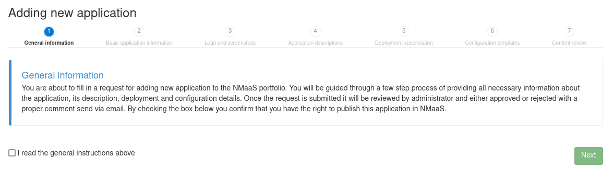

In the sections that follow we elaborate further on each step.

### Step 1: General Information

The general information step provides a brief description of the process for adding a new application to the nmaas catalog.

Users are required only to tick the `I read the general instructions above checkbox before proceeding to the next step, Basic application information`.

### Step 2: Basic Application Information

The Basic application information step requires the administrator to enter information that will describe the application and provide external links for the license, source code, official website, and tags.

All of this information is shown on the application details page. The tags are used to better classify the application in terms of the functionality that it offers.

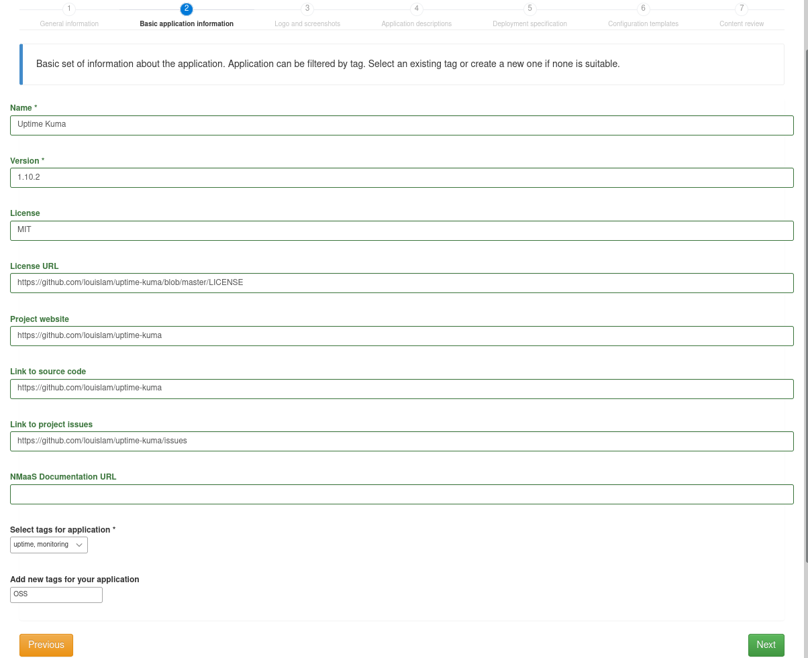

### Step 3: Logo and Screenshots

The third step asks the administrator to upload the application logo which will be shown in the catalog, as well as screenshots, showing the most common use-cases.

Before uploading any images, please ensure that you have the appropriate copyright permission to do so.

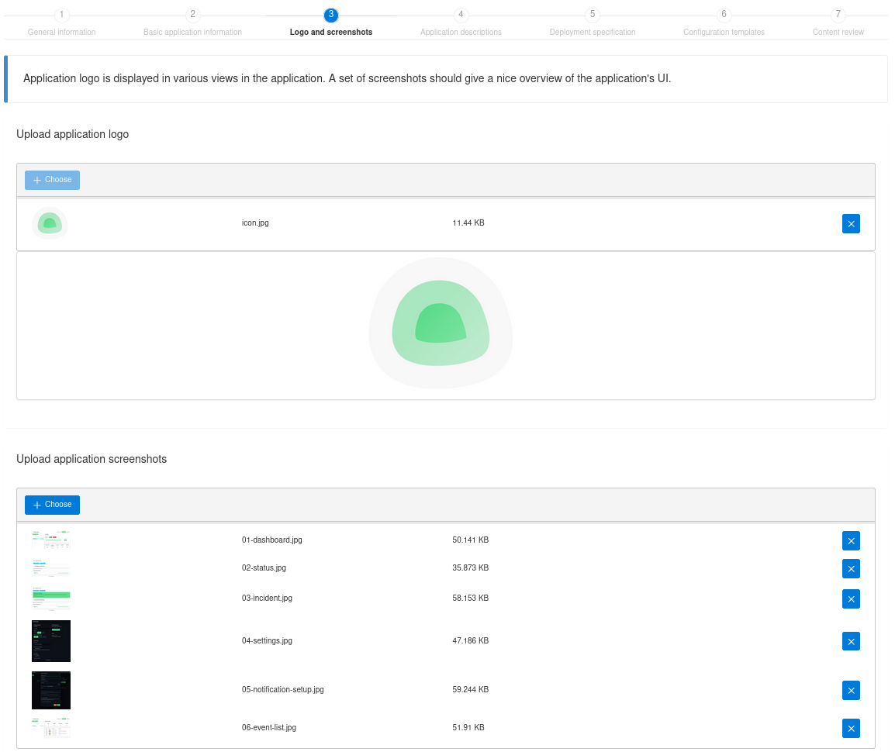

### Step 4: Application Descriptions

nmaas supports localization in multiple languages. By default the Application descriptions steps shows input fields for `Brief description` and `Full description` of the application in English. These fields should be used to provide a brief introduction for new users to the applications, explaining its features, as well as any default username or passwords that have been used and users are expected to change.

Translation of the content can be provided for additional languages by choosing the `Select optional languages` dropdown in the bottom left corner.

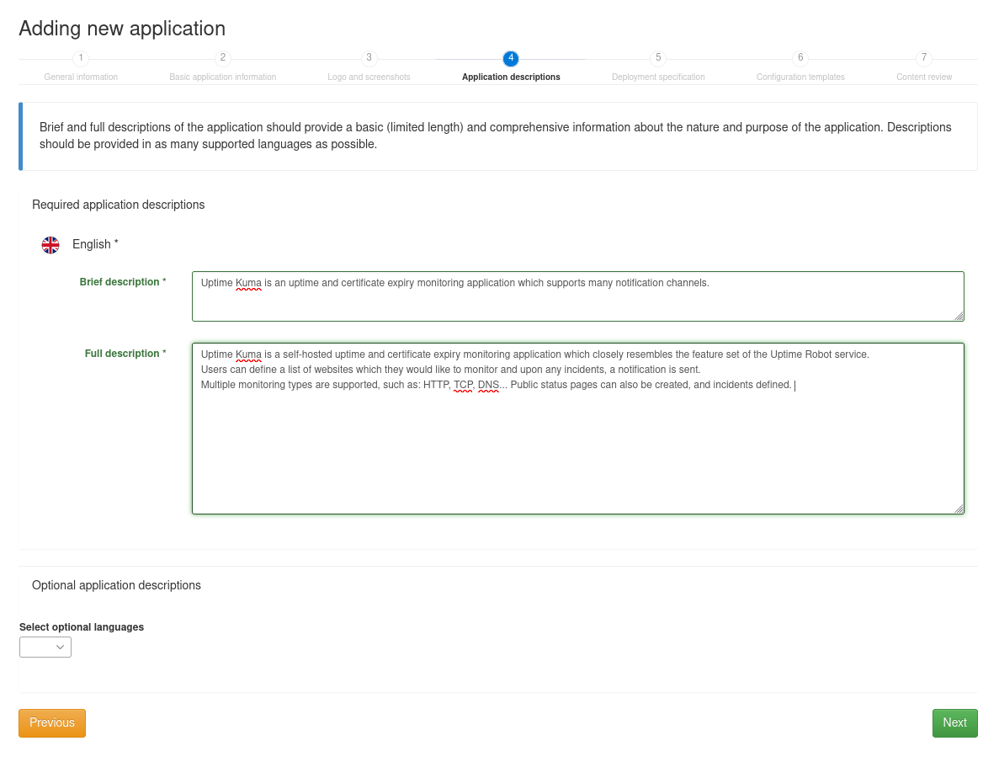

### Step 5: Deployment Specification

The deployment specification page contains common parameters that should be parametrized during the instance deployment procedure by end-users. These parameters are relevant for all applications, such as whether the application exposes a web interface, has a built-in SSH server, volume information... Additionally, in the `Static global deploy parameters` section, application maintainers can specify any additional parameters that should be passed as is to all new instances of the application. The `deploy parameter key` field should reference the `values.yaml` parameter that needs to be customized, while the `Deploy parameter value` its value.

#### Basic Application Information

The basic application information is consisted of the following fields:

- **Chart name** – the name of the Helm chart that has been uploaded to a public repository. All instances created by end-users will actually be Releases of this chart.
- **Chart version** – the chart version to be used for creating new application instances. Note that nmaas fully supports application versioning, and more than one application version can be active and available in the nmaas catalog at a given point in time. Additional versions can be added once the application has been integrated into the catalog.
- **Helm Chart repository URL address** – the full URL to the Helm repository where the chart is hosted.
- **Expose web user interface** – whether the application being added to the catalog exposes a web interface that should be reachable by users. In the case of UptimeKuma, this should be ticked.
- **Allow SSH access** – whether the application being added to the catalog comes with a built-in SSH server through which the users can directly connect to the container where the application is running, e.g., for additional configuration.

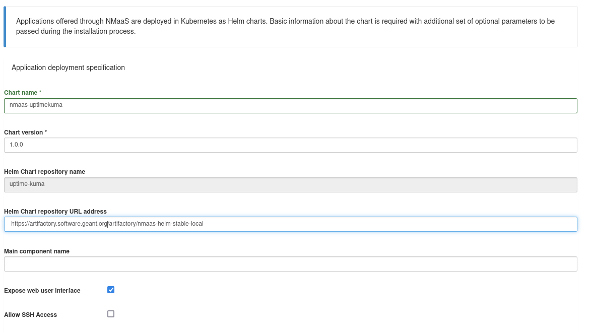

#### Global Deploy Parameters

The global deploy parameters allow the administrator to pass some globally defined nmaas variables to the Helm Release during its deployment. For example, many applications allow users to specify outbound SMTP servers which can be used for external email sending. Since nmaas already has an SMTP component, any deployed application can simply use the configured and tested nmaas email server. In this case, the system variables `SMTP_HOSTNAME`, `SMTP_PORT`, `SMTP_USERNAME`, `SMTP_PASSWORD` can be passed to arbitrary Helm value keys.

For example, the following configuration would pass the global `SMTP_HOSTNAME` deploy parameter as the `config.smtp.host` chart parameter whenever a new Release is created:

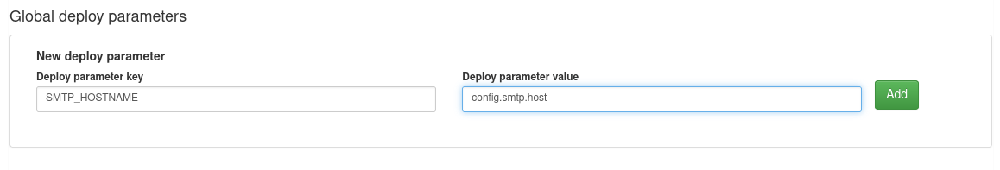

The following global deploy parameters are currently available:

- `SMTP_HOSTNAME`
- `SMTP_PORT`
- `SMTP_USERNAME`
- `SMTP_PASSWORD`
- `DOMAIN_CODENAME` – the name of the domain where the Release is being created
- `BASE_URL` – the URL at which the application will be accessible
- `RELEASE_NAME` – the name of the Helm Release


In the case of UptimeKuma, we do not need to configure any global deploy parameters.

#### Static Global Deploy Parameters

Static global deploy parameters allow the application administrator to specify custom parameters that should be passed to the chart whenever a new Release is being created. Please note that this is different than `Global Deploy Parameters` which were used to pass an ***internal*** nmaas parameter to each new Release.

In the case of static global deploy parameters, there is no limitation on what can be passed as a value. 

Let's assume that our chart has a values.yaml parameter that enables or disables new user registration, and this parameter is set to enable by default. If we want to disable new user registrations for each new Release and do not want the nmaas user to have an option to enable registrations, then we can simple disable this behavior using a static global deploy parameter. An example is given below.

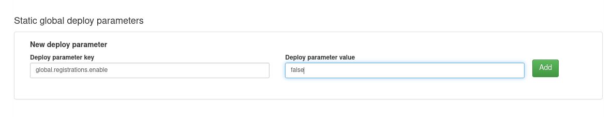

In the case of UptimeKuma, we do not need to configure any global deploy parameters, since the chart itself is relatively simple.

#### Storage Volumes

The storage volumes section allows the configuration of persistent volumes for each new release. This is similar to the global deploy parameters but this configuration has been externalized to a dedicated section in order to make it more straight forward. 

The following global variables should be passed to the respective chart parameters that deal with storage:

- `PERSISTENCE_ENABLED` (e.g., this option is commonly specified as `persistence.enabled` in charts)
- `PERSISTENCE_STORAGE_SPACE` (e.g., this option is commonly specified as `persistence.size` in charts)
- `PERSISTENCE_STORAGE_CLASS` (e.g., this option is commonly specified as `persistence.storageClass` in charts)
- `PERSISTENCE_NAME` (e.g., this option is commonly specified as `persistence.name` in charts)

The Default storage space input field allows the administrator to set a default value for new PersistentVolumeClaims created during instance deployment. The size is expressed in gigabytes. Users are usually given an option to customize this value by themselves.

In the case of UptimeKuma, the following configuration is required:

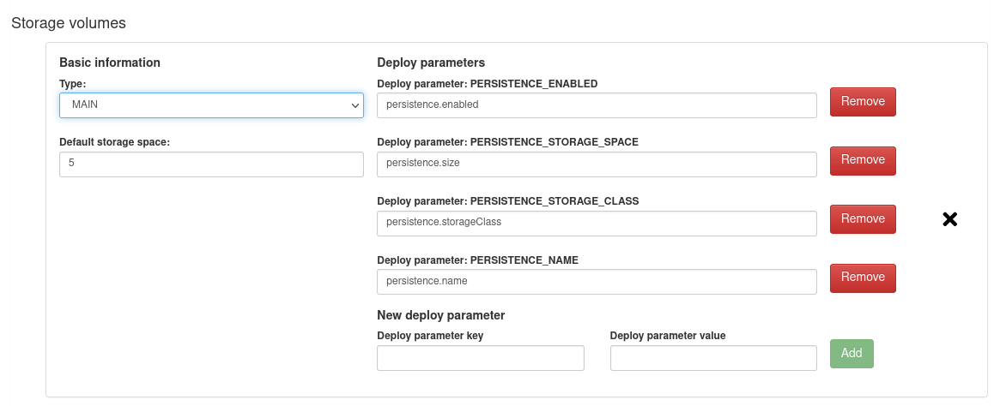

#### Access Methods

The Access Methods section allows the application administrator to customize the parameters related to external access. As previously, nmaas parameters are mapped to the appropriate parameters exposed by the Chart's values.yaml file.

Most of the parameters are self-explanatory, but some warrant additional attention. For example: the `INGRESS_CLASS` parameter will contain the ingress class that should be used for the newly deployed ingress object once the Helm Release is created. This is an essential information, since nmaas supports per-domain ingress controllers. Without this information, the wrong ingress controller will most like be used for serving, or the application would not be accessible at all.

In the case of UptimeKuma, the following configuration is required:

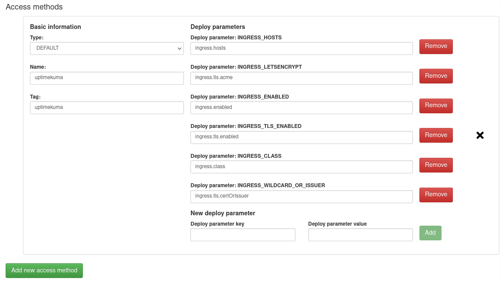

### Step 6: Configuration Templates

In the Configuration Templates step the administrator can specify which chart parameters can be specified by the end-users themselves. This step of the wizard offers a full-fledged form builder tool, which can be used for configuring the deployment parameters by the users. 

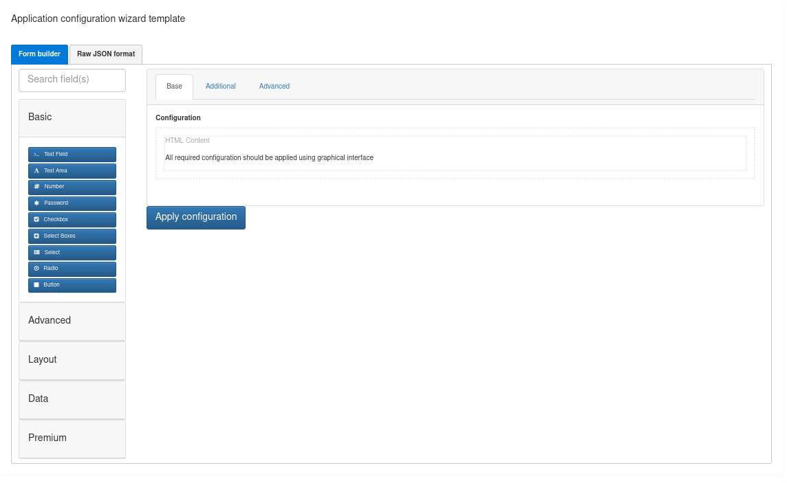

Let's presume that the chart exposes a `global.notifications.certificateExpiry` parameter which customizes whether the application will send certificate expiry notifications for added monitors or not. We can allow the nmaas users to customize this parameter in the following way.

- This parameter would best be modeled by a checkbox, so we drag-and-drop the checkbox component from the left hand side toolbar to the main canvas.
- In the `Display` tab enter basic information about the new form field, such as its label, description, and optional tooltip that will be shown on hover.

    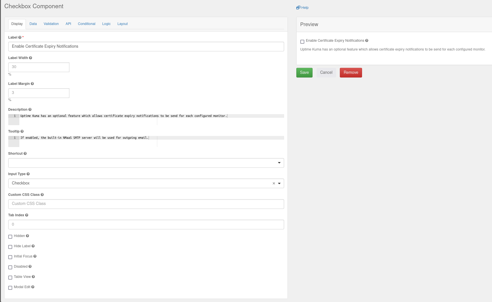

- In the API tab using the `Property Name` input field enter the `values.yaml` chart parameter to which this information should be passed. In our mock example this is `global#notifications#certificateExpiry`. Please note that instead of `.` (dot), the `#` (hash) sign should be used. This is a limitation of the web interface.

    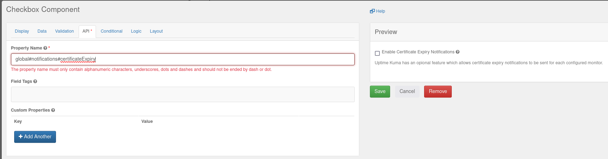

- Save the field configuration by clicking on the green Save button.

### Step 7: Content Review

The last step of the wizard is to simply review the entered information in the previous step and check the preview.

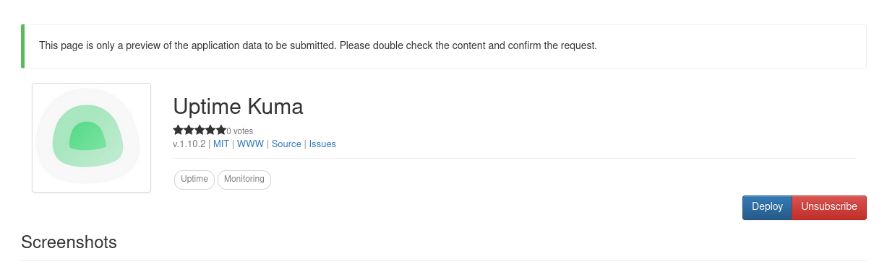

If no additional changes need to be made, the application can be submitted by clicking on the green Submit button.

### Approving the Application

Before the application will be shown to all users of the nmaas instance, it must be activated. This can be done from the Applications page by simply expanding the list of application versions, hovering on the cog button, selecting the `Change state` option and setting the state to `Active`.

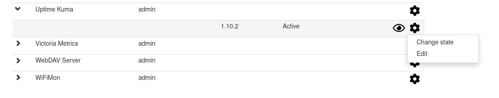