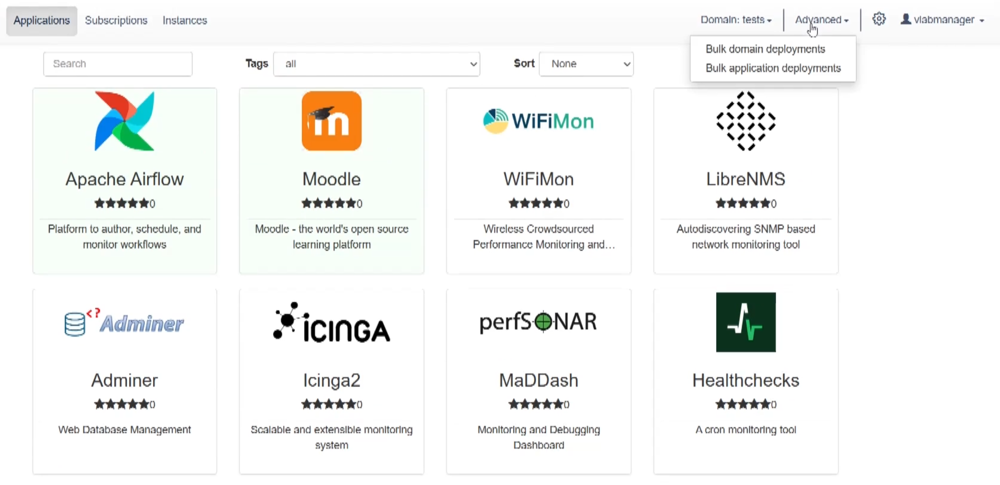
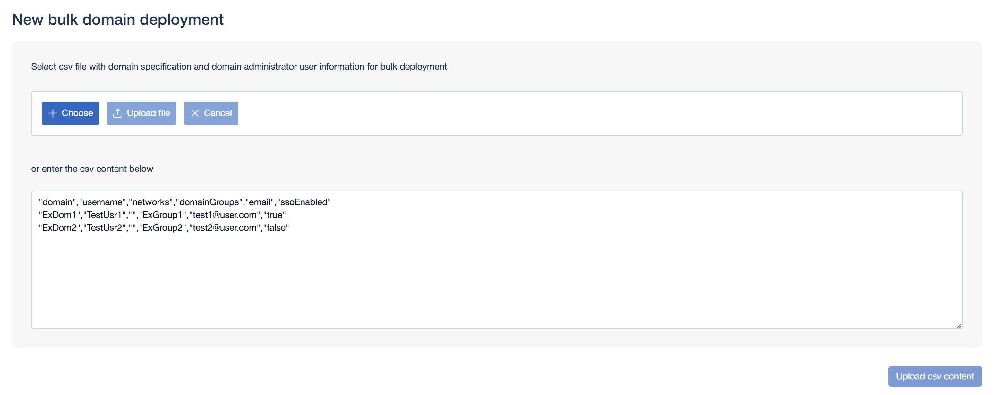
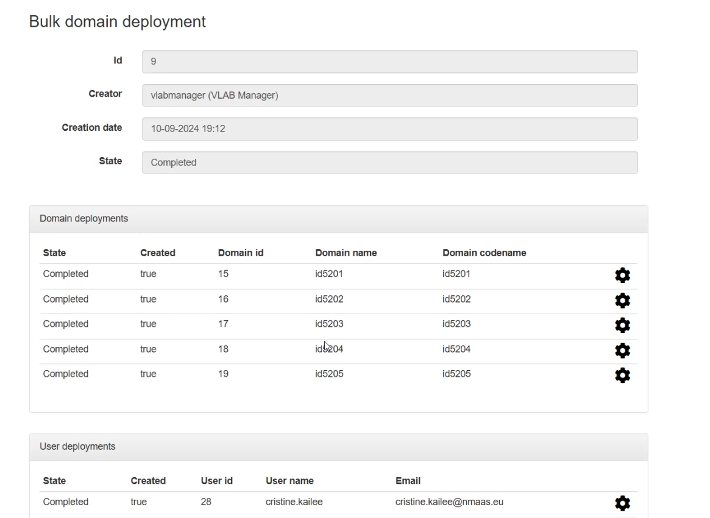

# Bulk Domain Deployment and User Registration

!!! info "Virtual Lab Manager Role"

    The virtual lab manager role is a global nmaas role that allows access to the bulk domain deployment and bulk application deployment features, among other things. To become a virtual lab manager on the manager vLAB nmaas instance, please contact the nmaas team using the [contact form](https://vlab.dev.nmaas.eu/about?type=VLAB_REQUEST). If you have access to a self-hosted nmaas instance, the global nmaas administrator can promote registered users to virtual lab managers.

Bulk domain deployments allow a virtual lab manager to register multiple virtual lab participants at once, using a simple CSV import process. During the user import, the necessary domain groups are created as well. A "domain group" is an nmaas feature that allows nmaas administrators to restrict which applications are available for deployment in which domains. This feature is useful for scenarios where a group of domains should have access to a restricted set of applications, instead of the whole catalog.

An example scenario for domain groups and one for which they were originally developed is virtual lab. When organizing virtual labs on nmaas, it is expected that many different users might need access to a different set of applications, but not to the whole catalog at once. This is the case when a university uses nmaas for conducting virtual labs for multiple courses. Students enrolled in course A might need access to applications 1, 2, and 3, while students in course B might need access to applications 4, 5, and 6. Assuming that the complete nmaas catalog also includes applications aimed at the teaching staff which might require additional compute resources or present security risks when deployed by students, such applications should not be deployable in the students' domains.

A prerequisite for performing a bulk domain deployment is to have the necessary information for each lab participant expected to take part in the virtual lab. This includes the domain name for their domain, their username used for logging in to the system, the name of the domain group that the domain should be part of and the email address of the user. Note that the bulk domain deployment process is idempotent, meaning that it can be repeated multiple times with the same data, without introducing any undesired changes. If a given lab participant already has an account and a domain in the system, their domain will simply be assigned to the specified domain groups, in addition to those it is already part of. Similarly for the domain groups, they are created only if no domain group with the same ID exists in the system, otherwise the creation process is skipped and only the new/existing domains are associated with it. A common approach for acquiring the necessary virtual lab participant data before continuing with the registration is to perform an export of the course participants from the LMS, if one is in use.

The steps to perform the bulk domain deployments are explained in detail below.

The virtual lab manager should use the landing page of the nmaas Platform to login with their account, either using the local sign-in form or leveraging the `Federated login` option, depending on their account type. After logging in, as the virtual lab manager is a privileged role, they have access to the whole catalog of enabled nmaas applications, without any restrictions. The bulk domain deployment process can be initiated by using the `Advanced -> Bulk domain deployments` option available on the right side of the top navigation menu.

If there are any existing bulk domain deployments that have been completed in the past, they will be shown in the overview page. A new bulk domain deployment can be initiated by clicking the blue `New deployment` button.

The details for the domains that need to be deployed, together with the necessary users to be registered and the domain groups to be created can be provided in one of two ways:

- by importing an existing CSV file
- by pasting the data in a CSV format directly in the web interface

No matter the chosen approach, the bulk domain deployment wizard shows the expected format of the CSV document.

The required fields are:

- `domain` - the name of the domain that the user should be part of. If it exists, the user is simply added to it as a member. If it does not exist, it is created, and then the user is made part of it.
- `username` - the username for the user. If it exists, the user is added to the given domain. If it does not exist, it is created and then added to the domain.
- `networks` - should be left blank, reserved for future use.
- `domainGroups` - domain groups that the domain needs to be part of. If a domain group already exists, the given domain is added to it. If the domain group does not exist, it is first created, and then the domains are joined to it.
- `email` - the email of the user. If email notifications are enabled at the nmaas instance level, a welcome email will be sent to the user.
- `ssoEnabled` - whether the user can login using the `Federated login` option or not. This is useful if the first import of users is done from an LMS export, but subsequent logins need to be done via SSO. This allows the user accounts to be fully set up and joined to the respective domain groups before the virtual lab participants are allowed to login to the system for the first time.

After providing the content and clicking either the `Upload file` button or the `Upload csv content` button, depending on whether the CSV file was uploaded or its content was pasted in the text area, the bulk domain deployment process will be initiated. After a couple of moments, an overview page will be shown, explaining the action that was taken for each user and domain.

In the image above we can see that all 5 domains were created (created column is true) since they did not exist before, along with the 5 user accounts.

After import, details about the domain group can also be seen by navigating to the `Domain groups` option using the cog wheel symbol in the navigation menu (next to the `Advanced` dropdown). As each domain group is identified by a descriptive name and a unique identifier, at this point the name can be changed to something else, such as the full name of the given course or module as part of which the lab exercises are organized.