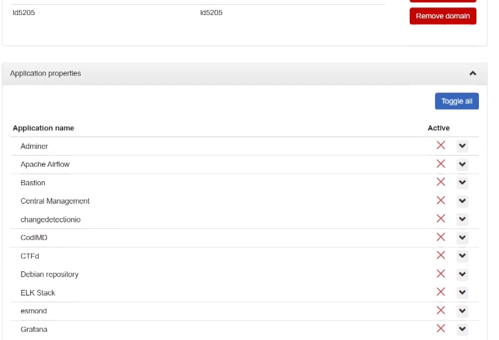
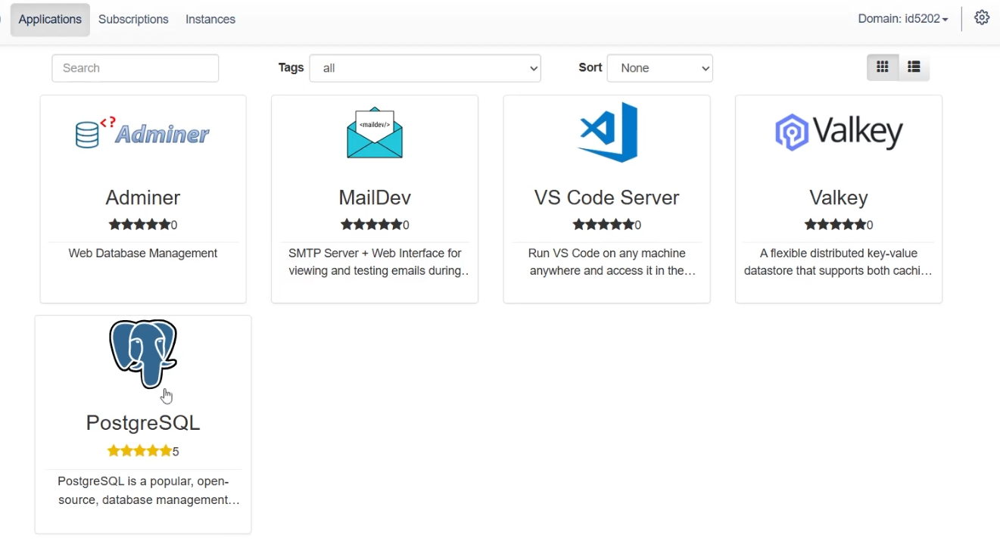

# Domain Groups Customization

!!! info
    This part assumes that the [Bulk Domain Deployment and User Registration](./p1_vlab-bulk-registration.md) part has already been completed as it uses resources which have been described and deployed in it.

If a virtual lab participant logs in to their newly created account before the virtual lab manager has had a chance to customize the list of whitelisted applications, they will simply see a blank catalog. No applications will be available for deployment, thus preventing any unexpected and unauthorized use of the available computing resources. Of course, if the participant has already been a member of a different domain group that contains whitelisted applications, these will still be available for deployment.

It is recommended that as soon as new domain groups are created, either manually or automatically using the bulk domain deployment feature, they are customized so that applications are whitelisted. Virtual lab managers can do this by using the cog wheel symbol in the top navigation menu and choosing the domain groups option. Once the details for a given domain group are opened, applications can be whitelisted using the `Application properties` section.

For this tutorial we will whitelist the following applications for deployment:

- Adminer - web application for database management
- MailDev - a dummy development email server
- PostgreSQL - relational database management system
- Valkey - caching server, fork of Redis
- VS Code Server - an online integrated development environment (IDE)

After the changes have been saved, lab participants that log in to the portal will see that these applications have become available for deployment and are visible in the `Applications` section of the web interface.

