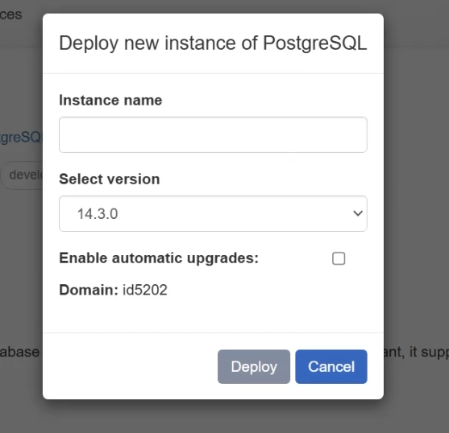
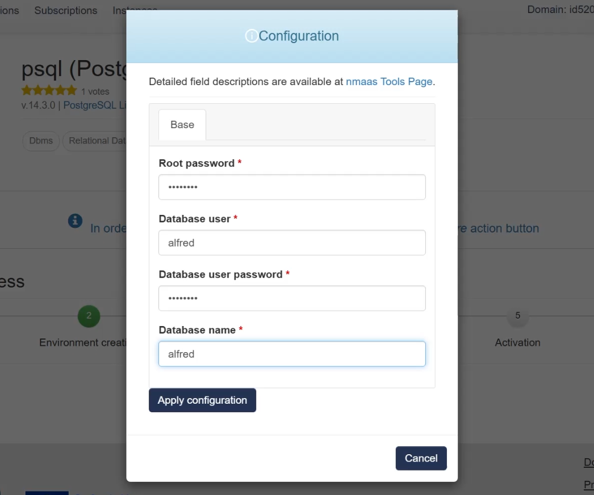
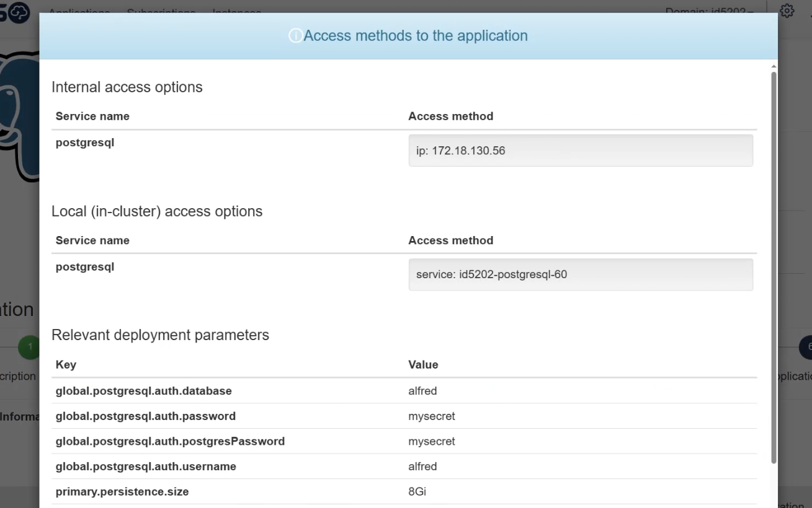
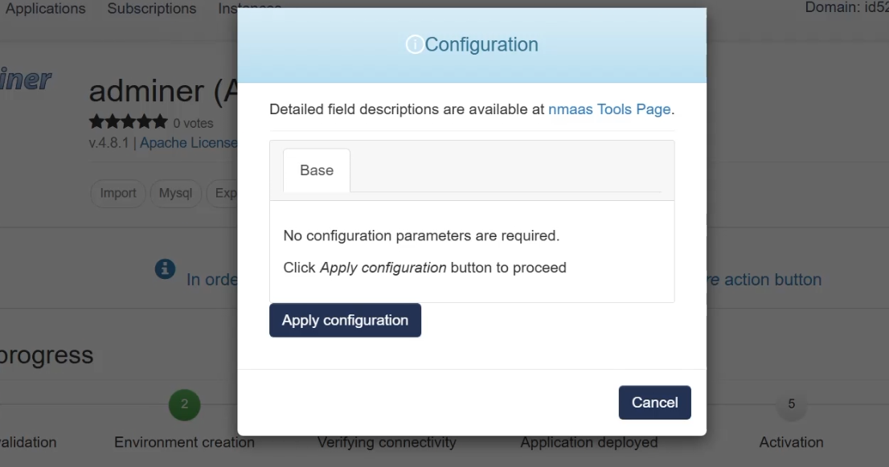
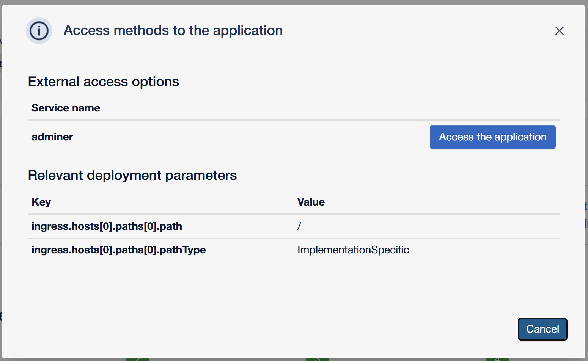
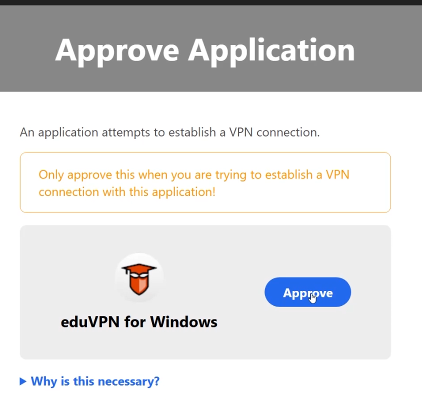
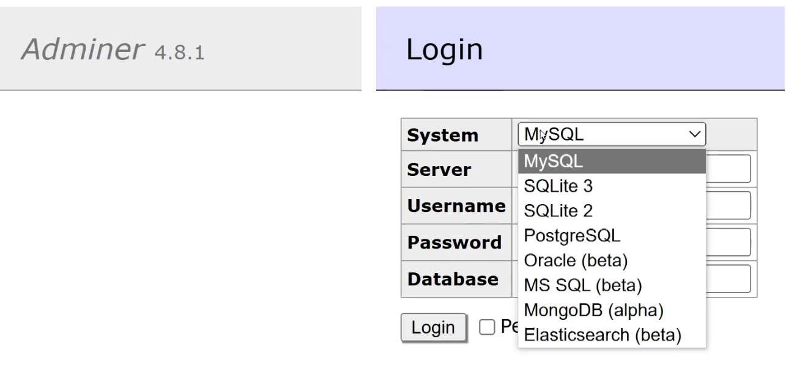
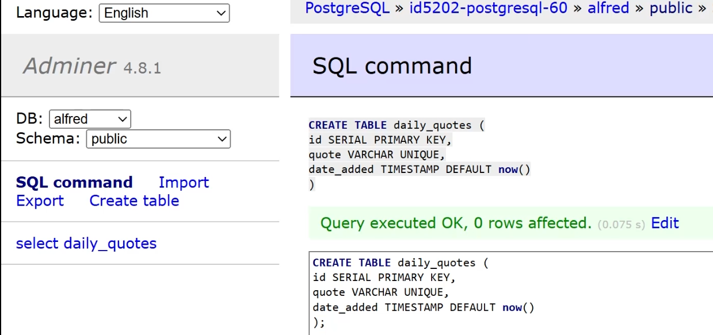
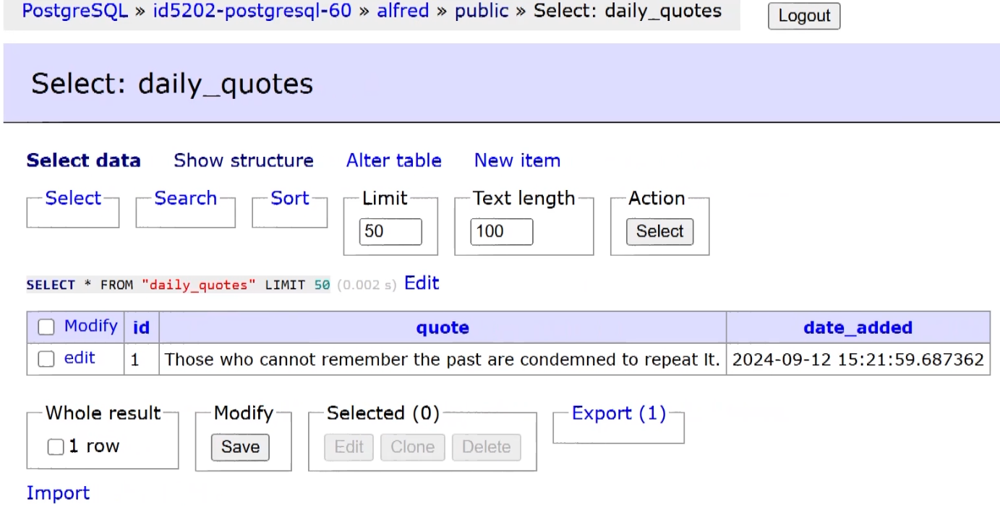
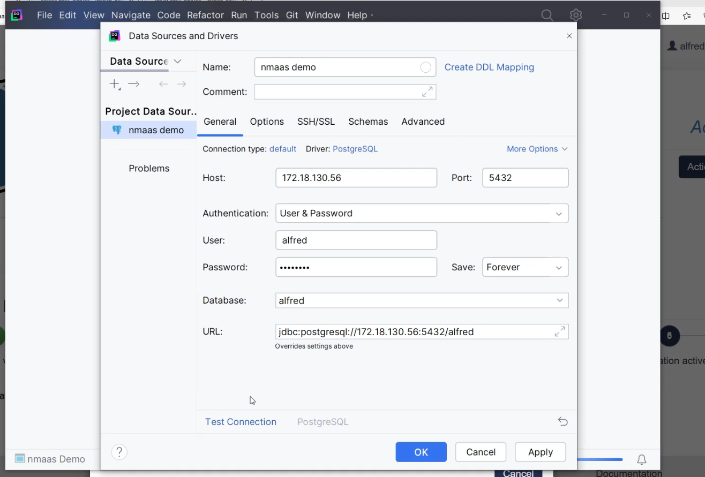

# Deploying the First Application

!!! info
    This part assumes that the [Domain Groups Customization](./p2_domain-groups-customization.md) part has already been completed as it uses resources which have been described and deployed in it.

While being logged in as a virtual lab participant, we can start with the deployment of the necessary applications to realize the desired web development scenario. The first application that will be deployed is PostgreSQL. 

The initial step that needs to be performed is "subscribing" to the application by clicking the `Subscribe` button. This will add the application to the `Subscriptions` page so that it is easily accessible later. After the application has been subscribed to, the `Deploy` button will become available. Clicking on it will open the first step of the application deployment wizard, asking for the `Instance name` and the `Version` of the application to be deployed. nmaas supports multiple versions of the same application and all enabled versions are at the users' disposal for deployment.  Optionally, during the deployment, the `Enable automatic upgrades` option can also be selected, but this option is only seen as useful for longer lived instances, where during the lifetime of the application's deployment new versions might become available. 



The next user action that is required is to fill out the configuration parameters for the given application. Each application can specify configuration parameters that need to be customized by the end-users during deployment. In the case of the PostgreSQL application these are:

- Root password
- Database user
- Database user password
- Database name



Once the configuration has been saved, the system will proceed with the application deployment. Behind the scenes, at this point, all relevant containers supporting the application are deployed in the Kubernetes cluster where nmaas has been installed. Once the application is successfully deployed, a new `Actions` button will appear in the user interface.  Clicking the `Access` option will provide the access details for the deployed application. 



Since PostgreSQL does not natively expose a web interface, we can use a helper application to connect to it. This application is Adminer.

The steps for deploying Adminer are the same as previously - finding it in the application list, subscribing to it, and initiating the application deployment wizard. In the case of Adminer, as it is a simple application, the user does not need to enter any configuration parameters during deployment.



As Adminer is a web based application, it does expose a web interface that can be accessed directly from the browser. To do so, the option `Actions -> Access the application` can be used. 



In the managed nmaas instances, to remotely access the deployed applications the users need a client-access VPN connection. If you are using a self-hosted nmaas instance deployed on premise or in a commercial cloud, the access strategy might differ. In the text that follows we will focus on the required steps to access the deployed instances when using the managed nmaas service.

The [vlab.dev.nmaas.eu](https://vlab.dev.nmaas.eu) instance requires the use of [eduVPN](https://www.eduvpn.org/) to access the applications remotely. eduVPN is an open-source VPN server and client developed within the GÉANT project. It uses the well-known and robust OpenVPN and Wireguard protocols behind the scenes. The major advantage that eduVPN provides is that users can login using SSO and generate new VPN profiles for all their devices, without a need for administrator intervention. 

The eduVPN client applications can be downloaded from the [official eduVPN website](https://www.eduvpn.org/client-apps/). Once installed, the user can search for their institution in the list of available eduVPN servers. If the eduVPN installation is not indexed, the user can connect by entering the fully qualified domain name of the eduVPN server, such as `eduvpn.nmaas.eu`.

The user will be redirected to the eduVPN login page where they can choose to authenticate either with a local account or an institutional account.



After the login request has been approved, the eduVPN client should successfully establish the VPN connection. The client access VPN that nmaas uses for the managed instances is split-tunnel, meaning that the default gateway of the user is not overridden. Instead, only the necessary subnet routes are pushed, so that remote access to the deployed applications on nmaas becomes available.

Once connected to the VPN, all deployed resources on nmaas should be remotely accessible, such as the Adminer instance that we just created.



Using the access details for the previously deployed PostgreSQL instance, we can connect to it using Adminer, so that we can test out if it works as expected. 

The demo application that we will be building in this tutorial is a random quotes application. The end goal is to expose an API which will provide one random quote per day. This random quote will be retrieved from the database when the first user visits the application in the day and it will then be cached in the Valkey server that is yet to be deployed. All subsequent API calls made within the same day will retrieve the same quote, cached in Valkey.

The model for this application is very simple, so we will use a single table. We can create this table immediately from the Adminer web interface by choosing the `SQL command` button and providing the corresponding definition:

```sql
CREATE TABLE daily_quotes (
    id SERIAL PRIMARY KEY,
    quote VARCHAR UNIQUE,
    date_added TIMESTAMP DEFAULT now()
);
```



In the same manner, we can insert the first quote.

```sql
INSERT INTO daily_quotes (quote) VALUES ('Those who cannot remember the past are condemned to repeat it.');
```

Using the Adminer `SELECT` option, we can see that indeed the quote has been inserted in the PostgreSQL database running on nmaas.



It should be pointed out that since we are connected to the client access VPN, we should be able to also access PostgreSQL directly from the workstation with any database management application. To do so, we can open the local database management application such as DBeaver or DataGrip and input the connection parameters as shown in the `Access` modal for the PostgreSQL instance on the nmaas web interface. 



