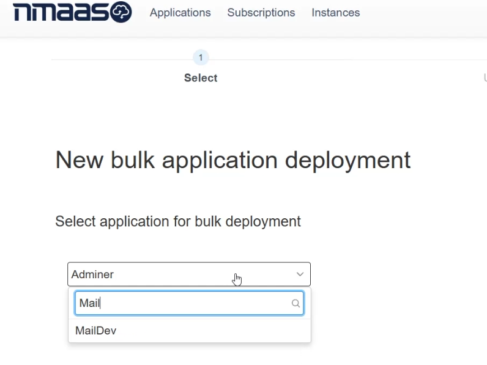
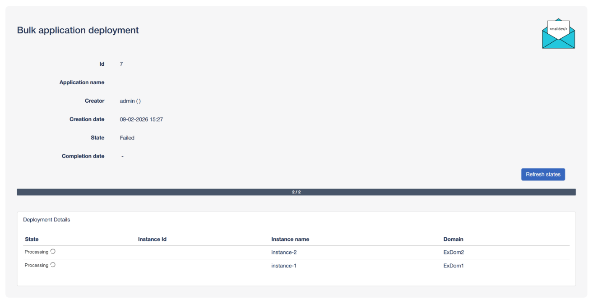
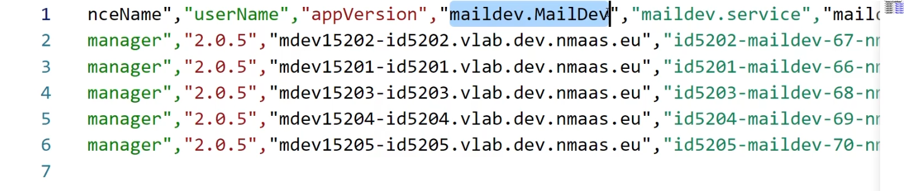

# Bulk Application Deployment

The last vLAB feature to be showcased using this tutorial is the bulk application deployment feature. This allows a virtual lab manager to deploy all required application instances in advance, on the behalf of the virtual lab participants. Utilizing this approach, the use of nmaas as the underlying platform for organizing and hosting the virtual lab exercises can be completely transparent to the virtual lab participants. 

To perform a new bulk application deployment, the virtual lab manager needs to choose the option `Advanced -> Bulk Application Deployments` from the right part of the top navigation menu.

The new bulk application deployment wizard starts off with a dropdown selector for the application to be deployed - in this case MailDev.

The next step is to either upload an existing CSV file or paste a CSV formatted text in the text area field, providing the details for the application instances to be deployed. The CSV file should have the following columns:

- domain - the domain where the application is to be deployed
- instance - the instance name. Please note that instance names need to be unique at the domain level.
- version - the application version to be deployed.
- param.x (optional) - any additional Helm parameters that need to be overridden during the application deployment. Can be omitted if no additional customizations are needed.

Once the CSV form is submitted, the virtual lab manager will be redirected to a new page from where they can track the deployment progress for each of the instances. 

The instances deployed in bulk behave just as other regular instances and if the virtual lab participant to whose domain an instance has been deployed in bulk logs in, they will be able to see the instance in the list of active instances. If email sending is also enabled at the global nmaas level, then the affected user will also receive an email notification that a new instance has been deployed in their domain, along with the access details. 

Virtual lab managers can also opt to deploy instances in bulk to a single "service" domain, not associated with a particular virtual lab participant. This avoids the email notification and provides the flexibility to share the access details for the instances in an out-of-band fashion, using a third-party system, such as an LMS. This can be accomplished by selecting the `Download CSV` option from the bulk deployment overview page. The resulting file will contain the information for the deployed instances, together with a description of the access methods, such as the URL of the application.

