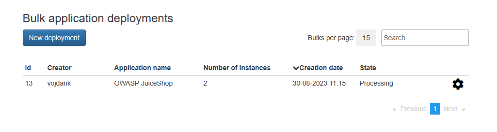
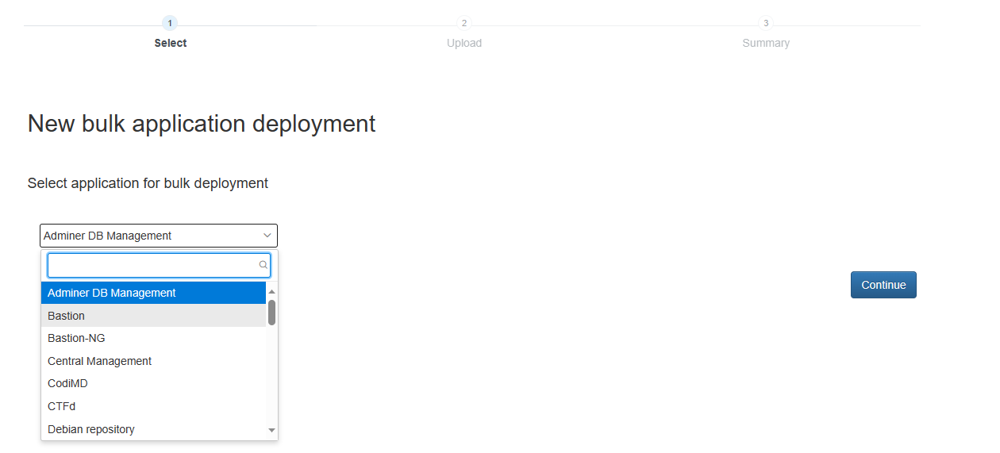
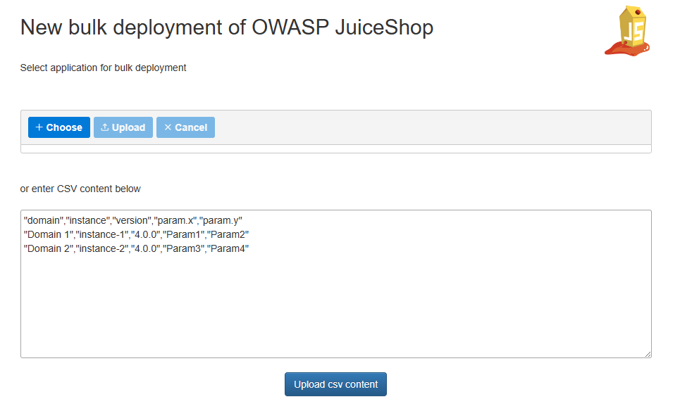
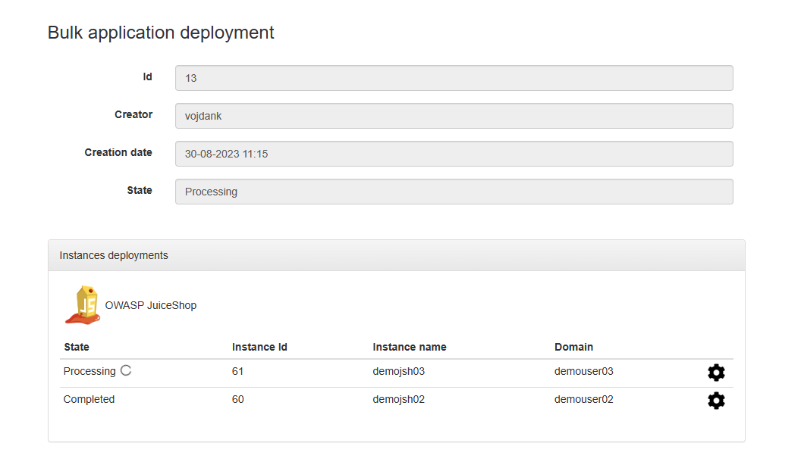
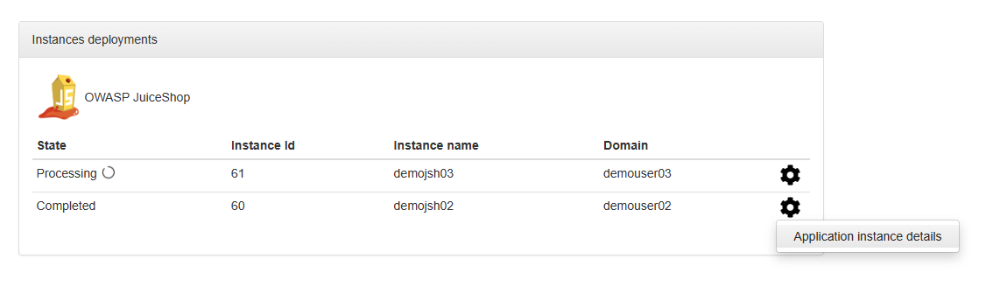
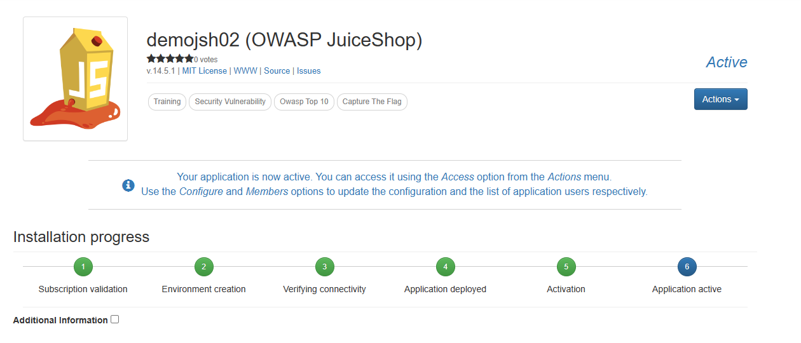

# Bulk Application Deployment

The "bulk application deployment" feature allows NMaaS administrators to deploy many application instances at once. This is useful for scenarios where NMaaS is used simply as an orchestration platform, and the end-users of the deployed applications should not be required to have an NMaaS account. 

## Bulk Application Deployment in the Context of Virtual Lab

When using NMaaS for the virtual lab use-case, teachers might want to deploy individual application instances for each student taking part in a course, without going over the account provisioning process first. There can be many reasons for taking this approach, such as:

- the NMaaS web UI is deployed in an isolated network without public access
- the students are not experienced enough with the use of PaaS-like platforms
- the process defined by the home institution regarding on-boarding of new users to NMaaS is too time consuming

After bulk deploying the applications, teachers can simply share the connection information with the students, completely abstracting away the use of NMaaS, and hiding any implementational details.

## Using Bulk Application Deployment

The bulk application deployment feature can be accessed by navigating to `Advanced -> Bulk application deployments`. Note that currently this feature is only available to global NMaaS administrators. 

The overview page shows a history of past bulk application deployments, with options either to see more details about a given deployment, or create a new one.

A new bulk application deployment can be initiated by clicking on the `New deployment` button.



The first step when launching the bulk application deployment wizard is to select which application is going to be deployed.



The second step is dedicated to customizing the deployments. A CSV file can be uploaded, specifying the domains in which the applications should be deployed, the application versions, and any auxiliary parameters which need to be overridden. These parameters are related to Helm parameters which are exposed in the underlying chart's `values.yaml` file.

A basic example of a CSV file which can be used for bulk application deployment is given below.

```csv
domain,instance,version,param.juiceshop.properties.ctfKey
demo-user02,demojsh02,14.5.1,SECRET1
demo-user03,demojsh03,14.5.1,SECRET1
```

In the example above the Helm parameter `juiceshop.properties.ctfKey` is customized for both of the deployments.

!!! warning "Additional Parameter Specification"

    Any Helm parameter can be overridden, assuming that it is prefixed with the static prefix `param.`. For example, if ingress support should be disabled for given bulk deployments, and assuming that the chart exposes an `ingress.enabled` flag, the CSV file will need to contain a dedicated `param.ingress.enabled` column.

The bulk deployment wizard supports either uploading an existing CSV file from the local device or editing the provided example directly in the browser.



Once the CSV file is uploaded, the applications will be instantiated in a background task. Administrators can follow the progress from the details page.



Once deployment is completed, connection details can be obtained on a per-application basis.





The video below demonstrates the bulk application deployment process.

