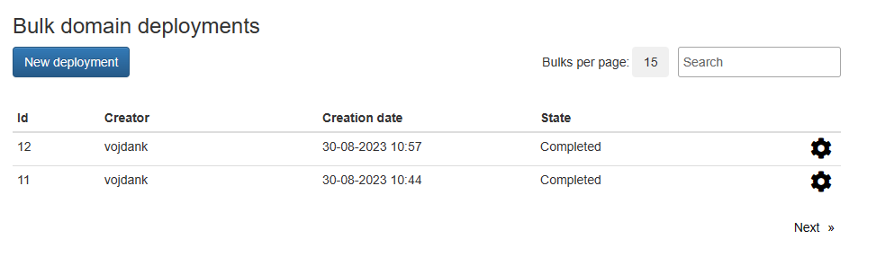
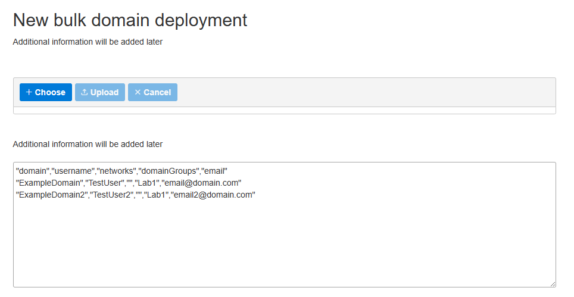

# Bulk Domain Deployment

The "bulk domain deployment" feature in NMaaS allows administrators to provision new domains and users in bulk. This is useful in cases where large groups of people should be registered at once, such as in the case with the virtual lab scenario.

## Bulk Domain Deployment in the Context of Virtual Lab

When NMaaS is used for virtual lab deployments, teachers might need to create new accounts for all enrolled students in a given course, create corresponding domains, and join them to appropriate[domain groups](./domain-groups.md). All of these tasks can be accomplished using the bulk domain deployment functionality. 

## Using Bulk Domain Deployment

Administrators can access the bulk domain deployment feature by navigating to `Advanced -> Bulk domain deployment`. From there, a history of existing bulk domain deployments can be seen, with an option to initiate a new one as well.



Clicking on the `New deployment` button opens the bulk domain deployment wizard. New domains can be specified either by using the built-in CSV editor or uploading an existing CSV file from the local device. 



The CSV file should have the following columns:

```csv
domain,username,networks,domainGroups,email
```

!!! notice "Registering New Users"
    Non-existent users can also be referenced in the CSV file for bulk domain deployment. In such cases, the user is automatically provisioned. Access to the NMaaS platform is provided to users after using the `Forgot password` functionality, and activating their account using the provided email address during the bulk domain provisioning.

!!! notice "Domain Groups"
    During bulk domain deployment, if any non-existent domain groups referenced in the CSV file are automatically created. After the domain import is completed, administrators should make sure to whitelist the desired applications for deployment, since by default all applications are blacklisted for new domain groups.