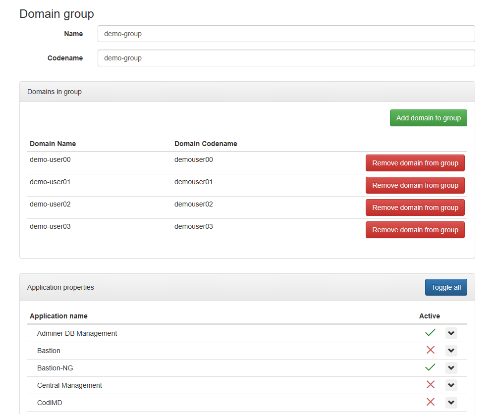

# Domain Groups in NMaaS

"Domain groups" is an NMaaS feature that allows NMaaS administrators to restrict which applications are available for deployment to given domains. This feature is useful for scenarios where a group of domains should have access to a restricted set of applications, instead of the whole catalog.

## Domain Groups in the Context of Virtual Lab

An example scenario for domain groups and one for which they were originally developed is virtual lab. When organizing virtual labs on NMaaS, it is expected that many different users might need access to a different set of applications, but not to the whole catalog at once. This is the case when a university uses NMaaS for conducting virtual labs for multiple courses. Students enrolled in course A might need access to applications 1, 2, and 3, while students in course B might need access to applications 4, 5, and 6. Assuming that the complete NMaaS catalog also includes applications aimed at the teaching staff which might require additional compute resources or present security risks when deployed by students, such applications should not be deployable in the students' domains.

## Using Domain Groups

Domain groups can be created during the bulk domain creation process, as well as manually. One domain group can contain multiple domains, and one domain can be part of multiple domain groups. Taking into account that one domain might partake in multiple domain groups, the formal list of applications deployable in a given domain is a **union** of all deployable applications allowed by all of the domain groups in which the given domain is a member. For example, if the domain `test-domain` is part of domain groups `group1`, `group2`, and `group3`, and assuming that they define the following lists of available applications:

- Domain group `group1`: `Zabbix`, `PostgreSQL`
- Domain group `group2`: `MariaDB`, `JuiceShop`
- Domain group `group3`: `InfluxDB`

In the scenario described above, `test-domain` would have access to all 5 applications: `Zabbix`, `PostgreSQL`, `MariaDB`, `JuiceShop`, and `InfluxDB`. The goal for this behavior is to allow a user to reuse a single domain across multiple courses, where each course might be represented by a separate domain group, allowing only the deployment of applications which are necessary for completing the course.

!!! warning "Initial Domain Group Settings"

    When creating a domain group for the first time, all of the applications are blacklisted. This means that a domain part of a single domain group where application policies have not been defined yet will not be able to deploy any application on NMaaS.

Domain groups can be managed by selecting the `Domain groups` option from the settings dropdown in the navigational menu (represented by a cog icon). Administrators are given the option to manually create a new domain group, manage domain group memberships, and alter the list of whitelisted/blacklisted applications for a given domain group.

