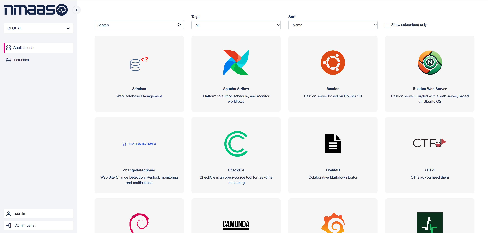
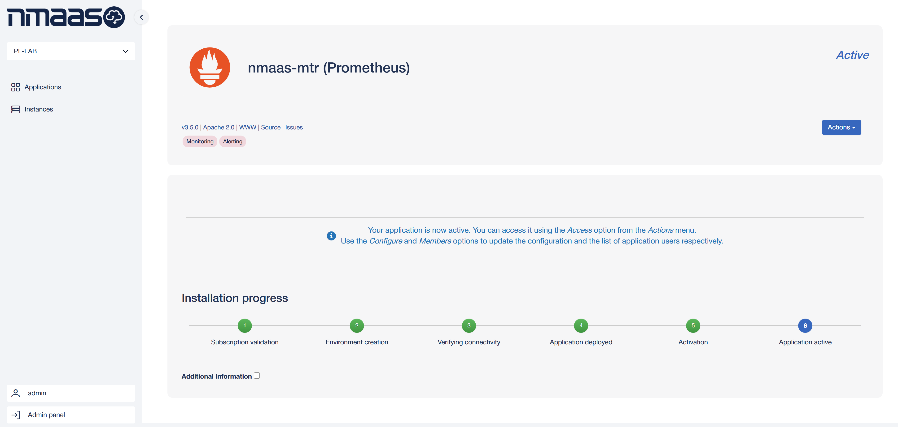
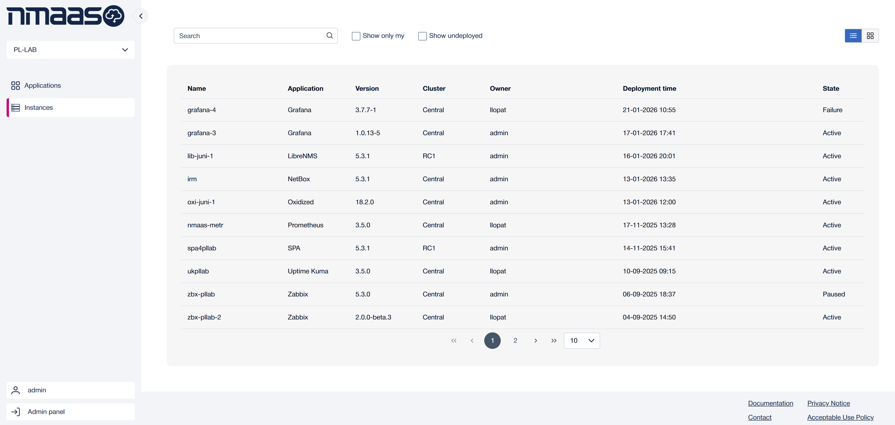
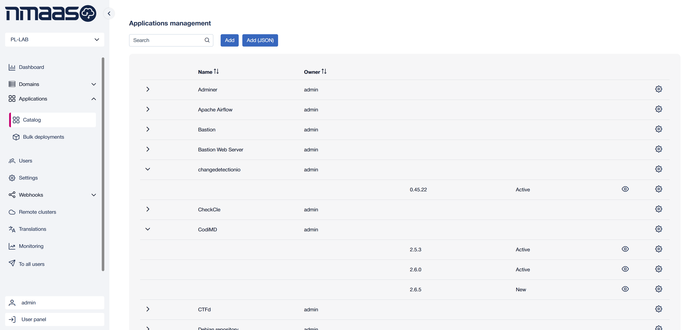
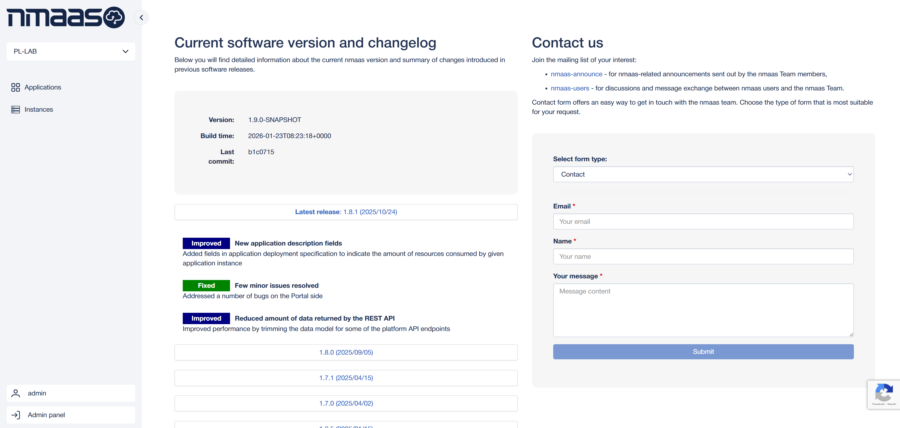

# What is **nmaas**?

## Introduction to nmaas

The nmaas platform is an [open-source](https://gitlab.software.geant.org/nmaas) framework originally developed within the [GÉANT](https://geant.org/projects/) project for orchestration of on-demand deployment of applications in a Kubernetes-based cloud environment.

With a simple self-service web interface, nmaas applications are easily deployed within an isolated tenant environment assigned to a given institution or team. An application’s lifecycle (configuration updates and re-deployments) is fully managed following a GitOps approach: a specific Git repository is tightly associated with every deployed application and a set of CI/CD pipelines ensure proper re-deployments of the applications following every update on the Git master branch, ensuring consistent configuration.

While nmaas can be used as part of many diverse use-cases, currently two are actively being expolored and supported within the GÉANT project:

- [nmaas for vNOC](use-cases/virtual-noc/vnoc-introduction.md)
- [nmaas for Virtual Lab](use-cases/virtual-lab/vlab-introduction.md)

## Gallery

{ width="350" }
{ width="350" }
{ width="350" }
{ width="350" }
{ width="350" }
{ width="350" }