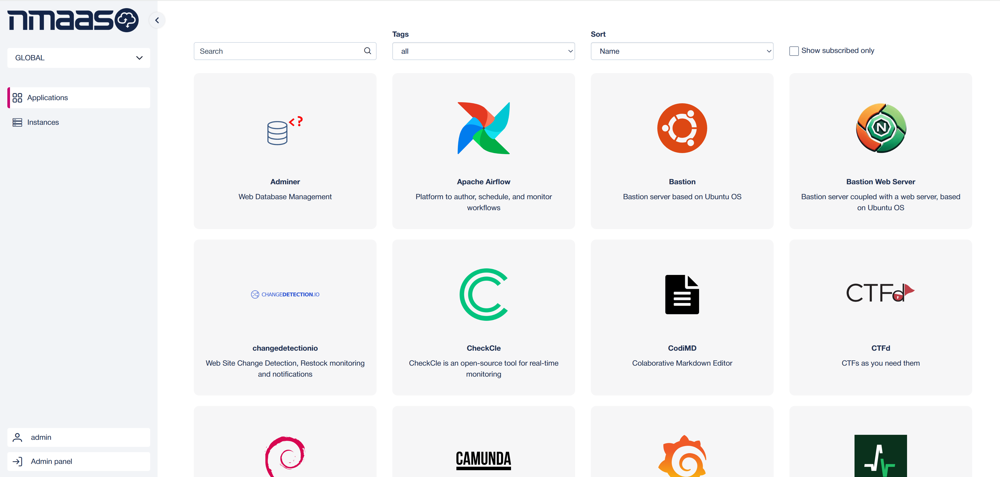
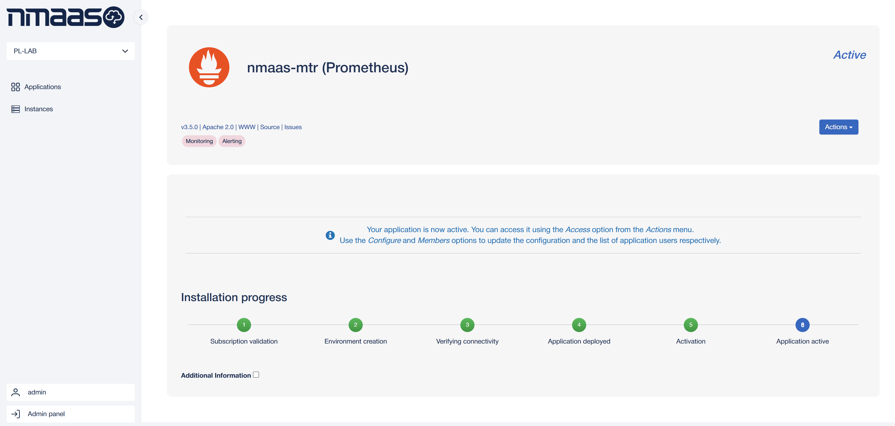
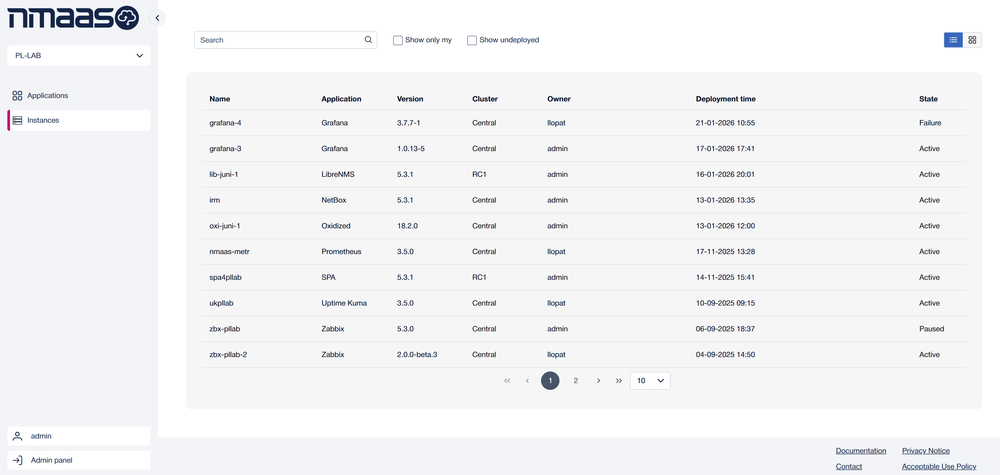
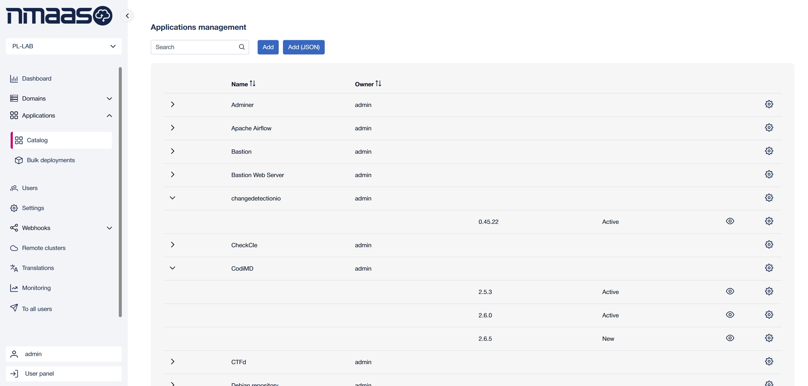
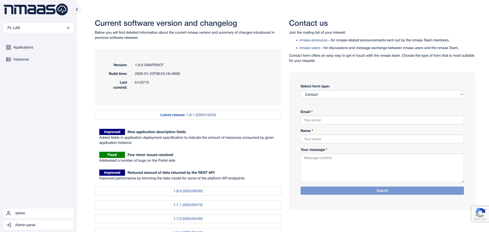

# What is **nmaas**?

The nmaas is an [open-source](https://gitlab.software.geant.org/nmaas) platform originally developed within the 
[GÉANT](https://geant.org/projects/) project for orchestrated on-demand deployment of applications in a Kubernetes-based 
cloud environment.

With a simple self-service web interface, nmaas applications are easily deployed within an isolated tenant environment 
assigned to a given institution or team. An application’s lifecycle (configuration updates and re-deployments) is fully 
managed following a GitOps approach: a specific Git repository is tightly associated with every deployed application, 
and a set of CI/CD pipelines ensure proper re-deployments of the applications following every update on the Git master 
branch, maintaining configuration consistency.

While nmaas can be used in diverse scenarios, the use cases currently explored and supported within the GÉANT project are:

- [Virtual NOC](use-cases/virtual-noc/vnoc-introduction.md)
- [Virtual Lab](use-cases/virtual-lab/vlab-introduction.md)
- [Metrics](use-cases/metrics/metrics-introduction.md)

## Gallery

{ width="350" }
{ width="350" }
{ width="350" }
{ width="350" }
{ width="350" }
{ width="350" }
